# IC Auto Optimization Workflow Project Structure

本文档定义第一版 MVP 的项目流程、角色边界、输入格式、文件结构和预计 token 消耗。

## 0. 核心共识

第一版采用 **Maestro-exported Spectre deck backend**：

- 用户在 Virtuoso / Maestro 中提前搭好 testbench、analysis setup、model/corner、save/output 设置。
- 用户与 **Hermes Agent** 交互。Hermes 是本地部署的 supervisor agent，类似 OpenClaw 风格的本地 agent，不是执行器。
- Hermes 通过原生 skill `Claude-cli-skill` 调用 Claude CLI / Claude Code execution agent。
- Claude Code 通过 `virtuoso-bridge-lite` 的 `virtuoso` skill 读取实际 Maestro setup，并用 `maeCreateNetlistForCorner` 导出 `input.scs`。
- 导出的 `input.scs` 是 setup source of truth。Claude Code 不允许擅自修改 tran / dc / sp / pss / pnoise / model include / simulatorOptions / saveOptions 等 simulation setup。
- Claude Code 只允许把用户指定的可调变量模板化，例如 `FN/WN/FP/WP -> @@FN@@/@@WN@@/@@FP@@/@@WP@@`。
- 优化主循环不跑 Maestro GUI，使用 `spectre` skill 批量运行渲染后的 Spectre deck，并使用 `optimizer` skill 执行初始化搜索 + TuRBO。

## 1. 完整流程图

```mermaid
flowchart TD
    U[User] --> H[Hermes Agent<br/>local supervisor]

    H --> H1[Parse structured Markdown task]
    H1 --> H2[Generate project config<br/>variables, metrics, constraints, objective]
    H2 --> H3[Generate metric contract<br/>metric name, unit, Maestro formula, required signals]
    H3 --> H4[Validate completeness]
    H4 --> H5[Build execution_package]

    H5 --> C0[Claude Code via Claude-cli-skill]

    C0 --> C1[Use virtuoso skill<br/>connect to Virtuoso/Maestro]
    C1 --> C2[Read/snapshot actual setup]
    C2 --> C3[Export Spectre deck<br/>maeCreateNetlistForCorner]
    C3 --> C4[Inspect input.scs]
    C4 --> C5{Can template only<br/>approved variables?}

    C5 -- no --> E1[Write escalation_report.json<br/>missing vars / resolved vars / setup issue]
    E1 --> H6[Hermes reviews escalation]
    H6 --> SI[Write supervisor_instruction.json]
    SI --> C0

    C5 -- yes --> C6[Create template.scs<br/>freeze setup, replace variables only]
    C6 --> C7[Implement local metrics.py<br/>from metric contract]
    C7 --> C8[Generate runner scripts]

    C8 --> D1[Dry run]
    D1 --> D2[Render one candidate netlist]
    D2 --> D3[Verify placeholders replaced]
    D3 --> D4[Import metrics.py]
    D4 --> D5[Mock SimulationResult]
    D5 --> D6[Test metrics, constraints, objective]
    D6 --> D7[Test ledger/state writes]
    D7 --> D8[Write dry_run_report.json<br/>and review_report.md]

    D8 --> H7[Hermes approval gate]
    H7 --> H8{Approve first real run?}
    H8 -- no --> SI
    H8 -- yes --> C9[Real optimization loop]

    C9 --> O1[Generate candidate batch<br/>LHS/Sobol/random init then TuRBO]
    O1 --> O2[Quantize, clamp, dedupe<br/>integer and step constraints]
    O2 --> O3[Render candidate decks]
    O3 --> O4[Run parallel Spectre jobs]
    O4 --> O5[Parse SimulationResult.data]
    O5 --> O6[metrics.py extracts metrics]
    O6 --> O7[Check hard constraints]
    O7 --> O8[Compute objective]
    O8 --> O9[Append ledger and update state]
    O9 --> O10[Write health_check.json]

    O10 --> O11{Healthy and budget left?}
    O11 -- yes --> O1
    O11 -- no issue / complete --> F1[Write final_summary.json]
    O11 -- abnormal --> E2[Write escalation_report.json]

    E2 --> H6
    F1 --> H9[Hermes generates final_report.md]
```



## 2. 用户输入示例

第一版要求用户使用半结构化 Markdown。用户不需要手写完整 simulation setup，但必须指定 testbench 定位信息、变量、metric 公式、约束和 objective。

```markdown
# 任务：bridge_test_inv 电路参数优化

## 0. Testbench Source

- Virtuoso library: Virtuoso_Bridge_test
- Cell: bridge_test_inv
- Design view: schematic
- Maestro view: maestro
- Test name: tran_dc_test
- Corner: Nominal
- Netlist source: use existing Maestro setup
- Netlist export method: maeCreateNetlistForCorner

说明：
- testbench 已在 Maestro 中设置好仿真。
- Claude Code 只能读取并导出 setup，不允许修改 setup。
- 需要 sweep 的变量已经在原理图器件参数中设置为同名变量。

## 1. 可调参数（仅允许调整以下四个变量）

| 变量 | 含义 | 器件 | 类型 | 取值范围 | step |
| --- | --- | --- | --- | --- | --- |
| FN | Number of fingers | M1 NMOS | integer | 2~12 | 1 |
| WN | Finger width | M1 NMOS | continuous_step | 0.3u~3u | 0.2u |
| FP | Number of fingers | M0 PMOS | integer | 2~12 | 1 |
| WP | Finger width | M0 PMOS | continuous_step | 0.3u~3u | 0.2u |

## 2. 仿真指标

每个指标必须提供 Maestro result 公式。Claude Code 根据公式和 Spectre raw data 实现 `metrics.py`。

| 指标 | 含义 | 单位 | Maestro result 公式 | required signals |
| --- | --- | --- | --- | --- |
| rise | 上升时间 | ps | `<用户提供 rise 公式>` | time, VOUT |
| fall | 下降时间 | ps | `<用户提供 fall 公式>` | time, VOUT |
| DC | 直流功耗 | u | `<用户提供 DC 公式>` | VDD, M0:3 或电源电流相关 raw signal |

## 3. 约束条件

- rise < 80 ps
- fall < 80 ps
- DC < 400 u

## 4. 优化目标

最小化：

```text
objective = (rise + fall) * DC
```

## 5. 仿真配置

- 并行仿真数量：10
- 仿真精度：ax
- 第一阶段初始化：Sobol 或 Latin hypercube
- 第二阶段优化：TuRBO
- 所有 candidate 必须按变量类型、bounds、step 量化。
```

## 3. Hermes Agent 职责

Hermes 是 supervisor，不是执行器。

Hermes 负责：

- 与用户交互，收集半结构化 Markdown 任务。
- 解析用户输入，生成项目配置文件。
- 生成并审查 metric contract。
- 确认以下内容完整：
  - testbench 定位信息
  - 可调变量、类型、bounds、step
  - metric 名称、单位、Maestro result 公式
  - hard constraints
  - explicit objective
  - Spectre mode、parallelism、optimizer budget
- 生成 Claude Code 的 execution package。
- 通过 `Claude-cli-skill` 调用 Claude Code execution agent。
- 审查 Claude Code 的准备阶段报告：
  - `netlist_preparation_report.json`
  - `dry_run_report.json`
  - `review_report.md`
- 在首次真实 Spectre / optimizer 执行前，生成批准或拒绝的 `supervisor_instruction.json`。
- 读取 `health_check.json`、`best_candidate.json`、`optimizer_state.json`、`experiment_ledger.jsonl`。
- 在异常时读取 `escalation_report.json`，基于 `CIRCUIT_KNOWLEDGE.md` 和 `FAILURE_PLAYBOOK.md` 生成 supervisor instruction。
- 优化结束后生成：
  - `state/final_summary.json`
  - `reports/final_report.md`

Hermes 不应该：

- 直接调用 Virtuoso / Spectre / optimizer skill 执行仿真。
- 擅自修改用户指定的 hard constraints、objective、变量范围。
- 直接写最终执行脚本替代 Claude Code。

## 4. Claude Code 职责

Claude Code 是 execution agent。

Claude Code 负责：

- 使用 `virtuoso-bridge-lite` 的 `virtuoso` skill 读取实际 Maestro setup。
- 调用 `maeCreateNetlistForCorner` 导出 ready-to-run `input.scs`。
- 检查导出的 `input.scs`：
  - model include 是否存在
  - analysis statements 是否存在，例如 `tran`、`dc`、`sp`、`pss`
  - simulatorOptions / saveOptions 是否存在
  - 用户指定变量是否以可模板化形式存在
- 生成 `netlist_preparation_report.json`。
- 只模板化允许变量，不修改其他 setup。
- 根据 metric contract 实现项目本地 `src/metrics.py`。
- 生成 runner 脚本和 optimizer loop 脚本。
- 进行 mandatory dry run：
  - parse config
  - render one candidate deck
  - verify placeholders
  - import `metrics.py`
  - run mock `SimulationResult`
  - compute metrics / constraints / objective
  - test ledger/state writes
- 写：
  - `dry_run_report.json`
  - `review_report.md`
- 在 Hermes 首次批准前，不运行真实 Spectre / optimizer。
- Hermes 批准后，使用 `spectre` skill 和 `optimizer` skill 执行完整优化闭环。
- 每批 candidate 更新：
  - `ledger/experiment_ledger.jsonl`
  - `state/optimizer_state.json`
  - `state/best_candidate.json`
  - `state/health_check.json`

Claude Code 不应该：

- 修改 Maestro setup。
- 修改 `input.scs` 中非变量模板化相关的内容。
- 修改 hard constraints、objective、bounds、step。
- 当 raw data 不足或变量无法模板化时自行猜测；必须写 escalation。

## 5. 完整项目文件结构

建议上层项目目录：

```text
D:/EDA_AI_AGENT/ic-auto-opt-workflow/
├── README.md
├── PROJECT_STRUCTURE.md
├── pyproject.toml
├── src/
│   └── hermes_workflow/
│       ├── __init__.py
│       ├── cli.py
│       ├── validate.py
│       ├── package.py
│       ├── schemas.py
│       └── report.py
├── templates/
│   └── spectre_maestro_project/
│       ├── TASK.md
│       ├── METRICS.md
│       ├── CIRCUIT_KNOWLEDGE.md
│       ├── FAILURE_PLAYBOOK.md
│       ├── config/
│       │   ├── project_config.yaml
│       │   ├── variables.yaml
│       │   ├── metrics.yaml
│       │   ├── spectre.yaml
│       │   └── optimizer.yaml
│       ├── netlists/
│       │   ├── README.md
│       │   ├── exported/
│       │   │   └── .gitkeep
│       │   └── templates/
│       │       └── .gitkeep
│       ├── src/
│       │   ├── metrics.py
│       │   ├── render_netlist.py
│       │   ├── run_candidate.py
│       │   ├── dry_run.py
│       │   └── optimization_loop.py
│       ├── execution_package/
│       │   └── .gitkeep
│       ├── ledger/
│       │   └── experiment_ledger.jsonl
│       ├── state/
│       │   ├── optimizer_state.json
│       │   ├── best_candidate.json
│       │   ├── health_check.json
│       │   └── final_summary.json
│       ├── reports/
│       │   ├── dry_run_report.json
│       │   ├── review_report.md
│       │   └── final_report.md
│       ├── escalation_report.json
│       └── supervisor_instruction.json
├── examples/
│   └── bridge_test_inv/
│       ├── USER_TASK.md
│       ├── expected_project_config.yaml
│       └── expected_input_scs_notes.md
└── tests/
    ├── test_validate_config.py
    ├── test_package_execution.py
    └── test_metric_contract.py
```

生成出的单个优化项目建议结构：

```text
projects/bridge_test_inv/
├── TASK.md
├── METRICS.md
├── CIRCUIT_KNOWLEDGE.md
├── FAILURE_PLAYBOOK.md
├── config/
│   ├── project_config.yaml
│   ├── variables.yaml
│   ├── metrics.yaml
│   ├── spectre.yaml
│   └── optimizer.yaml
├── netlists/
│   ├── exported/
│   │   ├── input.scs
│   │   ├── netlist
│   │   ├── qpInformation.ils
│   │   └── paramInfo.ils
│   └── templates/
│       └── template.scs
├── src/
│   ├── metrics.py
│   ├── render_netlist.py
│   ├── run_candidate.py
│   ├── dry_run.py
│   └── optimization_loop.py
├── execution_package/
│   ├── EXECUTION_TASK.md
│   ├── execution_manifest.json
│   ├── config/
│   ├── netlists/
│   └── src/
├── ledger/
│   └── experiment_ledger.jsonl
├── state/
│   ├── optimizer_state.json
│   ├── best_candidate.json
│   ├── health_check.json
│   └── final_summary.json
├── reports/
│   ├── netlist_preparation_report.json
│   ├── dry_run_report.json
│   ├── review_report.md
│   └── final_report.md
├── escalation_report.json
└── supervisor_instruction.json
```

## 6. Token 消耗预估

以下是面向 agent 交互的粗略 token 预算，不包含 Spectre 仿真本身的运行时间，也不包含超大日志完整粘贴。设计原则是：Claude Code 只把结构化摘要写入 report，避免把完整 raw log 注入上下文。

| 节点 | 主要参与者 | 预计 token | 说明 |
| --- | --- | ---: | --- |
| 用户输入解析 | Hermes | 3k ~ 8k | 读取用户 Markdown，抽取变量、metrics、constraints、objective |
| 配置生成与校验 | Hermes | 5k ~ 12k | 生成 YAML/JSON/Markdown；检查缺项和引用一致性 |
| execution package 生成 | Hermes | 5k ~ 10k | 生成 EXECUTION_TASK、manifest、metric contract、stub |
| Claude 启动与上下文读取 | Claude Code | 8k ~ 18k | 读取 execution package、相关 virtuoso/spectre/optimizer skill 摘要 |
| Maestro setup 读取与 netlist 导出 | Claude Code | 10k ~ 25k | 调用 virtuoso skill，导出 input.scs，读取并总结 setup |
| netlist preparation report | Claude Code | 5k ~ 12k | 检查变量模板化、include、analysis、saveOptions |
| metrics.py + runner 脚本生成 | Claude Code | 15k ~ 35k | 根据 metric contract 实现 metrics.py、render/run/dry-run 脚本 |
| dry run | Claude Code | 8k ~ 20k | mock SimulationResult、objective/constraint/ledger/state 写入测试 |
| 首次 self-review | Claude Code | 5k ~ 12k | 生成 dry_run_report 和 review_report 摘要 |
| Hermes 审批首次真实执行 | Hermes | 5k ~ 15k | 审查报告，生成 supervisor_instruction |
| 每批 optimizer loop 摘要 | Claude Code | 3k ~ 8k / batch | 每批 10 个 candidate，只汇总健康状态和 best candidate |
| escalation 处理 | Hermes + Claude | 10k ~ 30k / 次 | 取决于错误复杂度；只传结构化错误摘要和必要日志尾部 |
| final summary/report | Hermes | 8k ~ 20k | 读取 ledger/state 摘要，生成 final_summary 和 final_report |

建议预算：

```text
首次完整准备 + 首次真实执行审批:
  约 70k ~ 170k tokens

正常优化阶段:
  每 10 个 candidate batch 约 3k ~ 8k tokens

100 次仿真、10 并行、无重大异常:
  约 100k ~ 250k tokens

有 2~3 次 escalation:
  约 140k ~ 340k tokens
```

控制 token 的规则：

- 不把完整 `input.scs`、`spectre.out`、`logFile` 注入对话，除非调试需要。
- 报告中保留路径、hash、关键摘录、analysis 列表、变量检测结果。
- ledger 使用 JSONL 持久化，不依赖聊天历史。
- Hermes 读取最终 summary，不重读所有 raw 仿真输出。

## 7. 待确认的接口点

当前设计假设：

```text
Hermes Agent --Claude-cli-skill--> Claude Code execution agent
```

后续实现前需要确认 `Claude-cli-skill` 的具体接口：

- 如何传入 `execution_package` 路径
- 如何指定 Claude Code 必须使用的 skills
- 如何让 Claude Code 暂停等待 Hermes 审批
- 如何读取 Claude Code 生成的 report/state 文件
- 如何限制 Claude Code 不修改 immutable contract 文件

这些接口细节不影响项目文件协议，但会影响 CLI 和 execution package 的具体命令格式。
