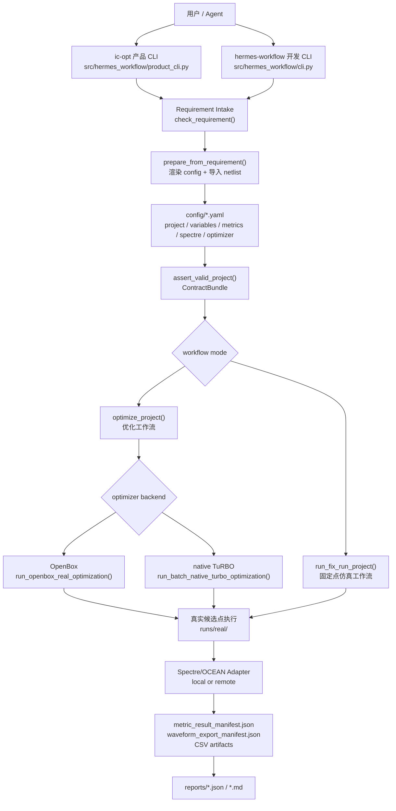
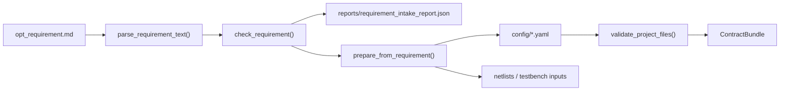
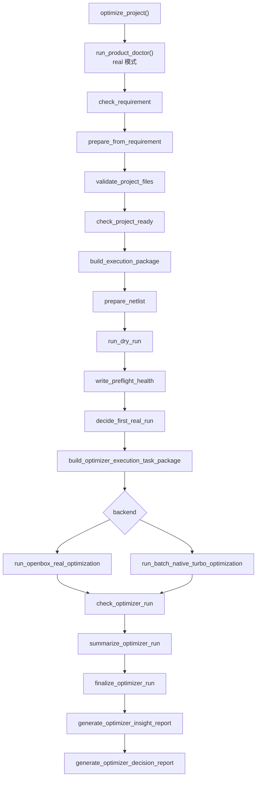
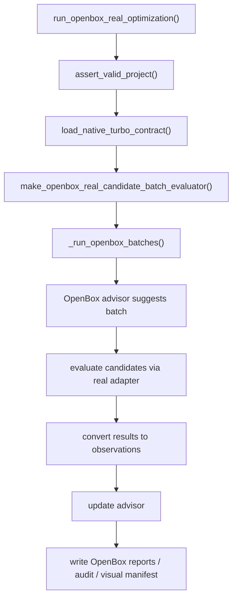
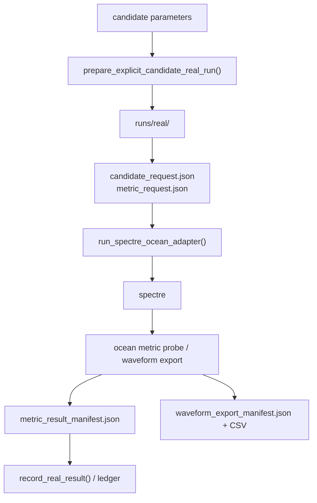
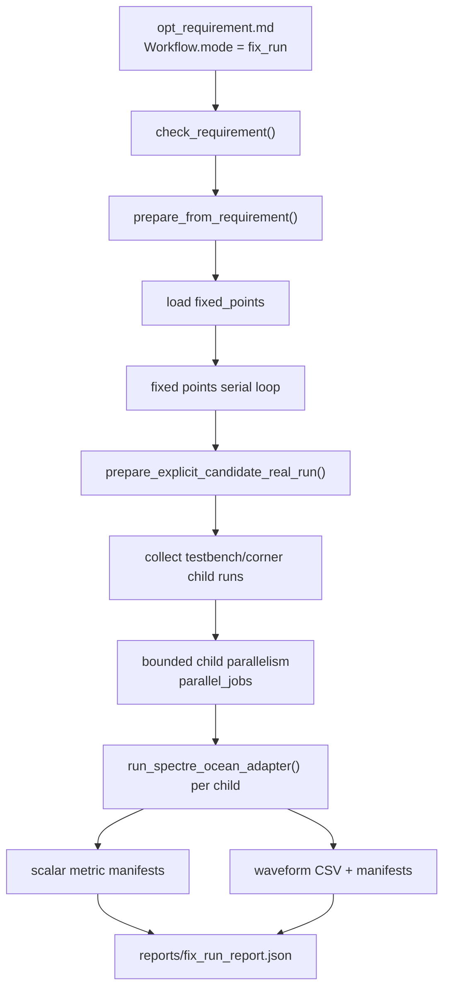
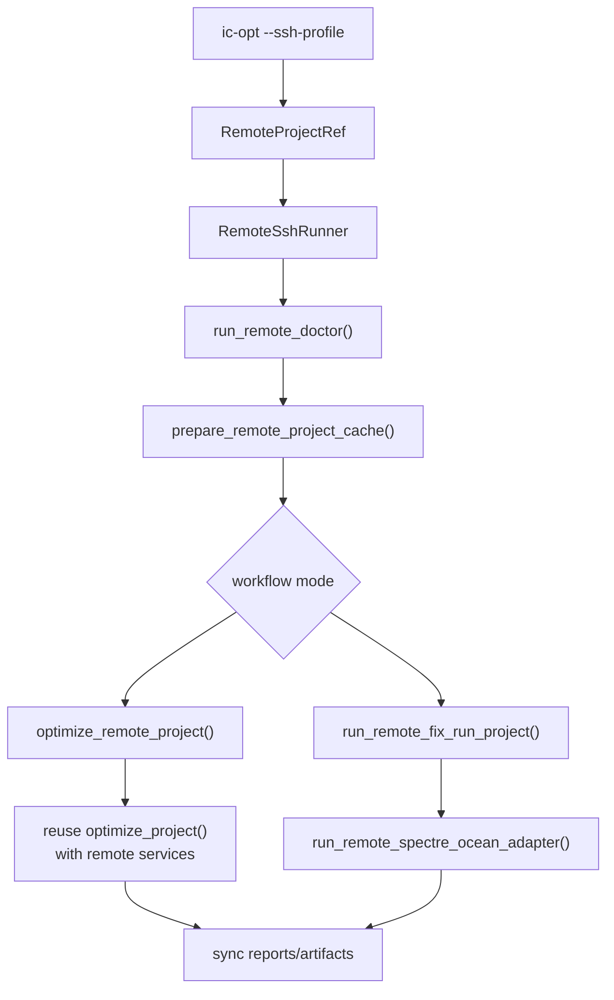
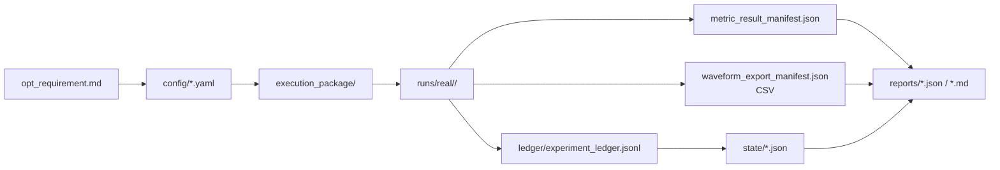

# IC Auto Opt Workflow 架构地图

日期：2026-06-18

本文是给人阅读的项目结构导览。它不是 API 文档，也不是历史状态总结；目标是帮助维护者快速理解 `ic-auto-opt-workflow` 的工作原理、源码入口、核心数据流和复杂度热区。

依据：

- graphify 图谱：`graphify-out/GRAPH_REPORT.md`、`graphify-out/graph.html`、`graphify-out/graph.json`
- codegraph 源码确认：核心入口函数、调用关系和文件边界
- 当前源码树：`src/hermes_workflow/`

注意：当前 codegraph 索引里同时能看到 dev checkout 和 release checkout 的同名符号。本文所有源码路径默认指向 dev 包 `ic-auto-opt-workflow/`。

## 1. 一句话总览

这个项目把用户写的 `opt_requirement.md` 转成确定性的配置、netlist、执行包、仿真任务、优化结果和报告。它有两条主要产品工作流：

- `optimize`：自动搜索设计变量，调用 OpenBox 或 native TuRBO 后端，驱动 Spectre/OCEAN 实测并生成优化结论。
- `fix_run`：不搜索，只按用户给定的固定参数点跑真实仿真，保存 scalar metrics、waveform CSV 和固定点报告。

项目的核心不是一个“智能体”，而是一套 workflow tooling。agent 可以调用它，但 Hermes workflow 本身负责文件合同、校验、执行编排和报告落盘。

## 2. 总体结构图



## 3. 用户入口层

### 产品入口：`ic-opt`

主要文件：

- `src/hermes_workflow/product_cli.py`
- 入口函数：`main()`

职责：

- 解析产品级参数：`PROJECT_DIR`、`--real`、`--doctor`、`--continue`、`--ssh-profile`、`--cadence-cshrc`
- 判断 local / remote
- 判断 doctor / continue / real run
- 根据 `opt_requirement.md` 的 workflow mode 分发到 optimize 或 fix-run

产品 CLI 当前是一个大分发器，适合作为用户入口，但不是理想的内部架构边界。后续如果继续扩展，应该把 remote/local/doctor/continue/fix-run/optimize 分支拆成小 handler。

### 开发入口：`hermes-workflow`

主要文件：

- `src/hermes_workflow/cli.py`

职责：

- 暴露更细粒度的开发和验证命令
- 方便测试单个环节，例如 validate、package、dry-run、prepare-real-run、run-openbox-real、summarize、finalize

理解项目时，先看 `ic-opt`；调试某个步骤时，再看 `hermes-workflow`。

## 4. Requirement 和合同层

这是项目最重要、也最健康的边界之一。



主要文件：

- `src/hermes_workflow/requirement_intake.py`
- `src/hermes_workflow/requirement_semantics.py`
- `src/hermes_workflow/schemas.py`
- `src/hermes_workflow/validate.py`

核心函数：

- `check_requirement(project_dir)`
- `prepare_from_requirement(project_dir)`
- `assert_valid_project(project_dir)`
- `load_contract_bundle(project_dir)`

关键概念：

- `opt_requirement.md` 是用户意图的源头，不是普通说明文档。
- `prepare_from_requirement()` 把 markdown 里的结构化 YAML 渲染成标准 `config/*.yaml`。
- `assert_valid_project()` 是后续执行前的统一入口。它只做两件事：校验项目文件，然后加载 `ContractBundle`。
- `ContractBundle` 把 variables、metrics、spectre、optimizer、testbenches 等配置组织成后端能稳定消费的结构。

判断一个改动是否健康，可以先问：它是否保持了 `opt_requirement.md -> config -> ContractBundle -> artifacts` 这条合同链的确定性。

## 5. Optimize 工作流

源码入口：

- `src/hermes_workflow/optimizer_flow.py`
- 入口函数：`optimize_project()`

主流程：



`optimize_project()` 的优点是流程显式，读它能直接看到产品门禁顺序。缺点是函数较长，后续适合抽成“step plan + step executor”，但不应在普通 bugfix 中顺手重构。

重要输出：

- `reports/optimizer_flow_run_report.json`
- `reports/openbox_optimizer_report.json`
- `reports/openbox_optimizer_evaluations.jsonl`
- `reports/optimizer_run_report.json`
- `reports/optimizer_completion_report.json`
- `reports/optimizer_decision_report.md`
- optimizer insight / visualization artifacts

## 6. Optimizer 后端

### OpenBox 后端

主要文件：

- `src/hermes_workflow/openbox_backend.py`

关键入口：

- `run_openbox_real_optimization()`
- `_run_openbox_batches()`
- `make_openbox_real_candidate_batch_evaluator()`

结构：



`run_openbox_real_optimization()` 是健康的薄入口；真正复杂的是 `_run_openbox_batches()`。它同时负责 batch 生成、重复点替换、真实执行、observation 更新、effectiveness audit、report 写入和 early stop。它是当前 optimizer 层最需要长期治理的热点。

### native TuRBO 后端

主要文件：

- `src/hermes_workflow/native_turbo.py`

关键入口：

- `run_batch_native_turbo_optimization()`
- `run_native_turbo_optimization()`
- `_initial_unit_design()`

这个后端负责 TuRBO / Sobol / batch parallel 相关逻辑。它和 OpenBox 后端共享很多报告、candidate、real-run artifact 概念，但后端算法路径不同。

## 7. Real Run 和 Spectre/OCEAN 执行层

真实仿真的核心结构是：先把某个 candidate 或 fixed point 写成可执行 run package，再由 adapter 调 Spectre/OCEAN，最后把结果落成 manifest 和报告。



主要文件：

- `src/hermes_workflow/real_run.py`
- `src/hermes_workflow/execution_adapters/spectre_ocean.py`
- `src/hermes_workflow/metric_results.py`
- `src/hermes_workflow/real_result_record.py`
- `src/hermes_workflow/result_handoff.py`

核心概念：

- `runs/real/<run_id>` 是真实仿真的执行事实目录。
- `metric_result_manifest.json` 是 scalar metric 结果的合同文件。
- `waveform_export_manifest.json` 和 CSV 是 waveform export 的合同文件。
- `experiment_ledger.jsonl`、optimizer state、best candidate 等文件记录优化状态。

这个层的设计重点是 fail-closed：不能因为工具输出缺失、manifest 缺失、CSV 缺失而假装成功。

## 8. Fix-Run 工作流

源码入口：

- `src/hermes_workflow/fix_run_flow.py`
- 入口函数：`run_fix_run_project()`

fix-run 不搜索参数。它读取用户给定的 fixed points，逐点跑真实仿真。



重要语义：

- 多个 fixed point 之间当前是串行。
- 单个 fixed point 内的 testbench/corner child 可以按 `parallel_jobs` 并行。
- `threads_per_run` 是每个 Spectre 进程的线程数。
- `parallel_jobs` 是同一个 fixed point 内同时跑多少个 child。
- fix-run 不创建 optimizer state，不生成 optimizer decision report。

主要输出：

- `reports/fix_run_report.json`
- 每个 child 的 scalar metric manifest
- waveform export manifest
- waveform CSV

## 9. Remote 工作流

remote 不是另一套业务逻辑，而是 local flow 外面的一层传输和缓存包装。



主要文件：

- `src/hermes_workflow/remote_project.py`
- `src/hermes_workflow/remote_runner.py`
- `src/hermes_workflow/remote_doctor.py`
- `src/hermes_workflow/remote_prepare.py`
- `src/hermes_workflow/remote_optimizer_flow.py`
- `src/hermes_workflow/remote_fix_run_flow.py`
- `src/hermes_workflow/execution_adapters/remote_spectre_ocean.py`

关键点：

- `RemoteProjectRef` 是 remote 的核心身份对象，包含 ssh profile 和 remote project dir。
- `RemoteSshRunner` 负责 SSH 命令执行。
- `remote_optimizer_flow.py` 通过 service injection 复用 `optimize_project()`，这是健康方向。
- remote fix-run 和 local fix-run 保持报告语义一致，但 adapter 和 artifact sync 是 remote 专属复杂度。

## 10. Doctor 和 readiness

doctor 的作用不是跑优化，而是在真实工具启动前检查项目、环境、资源和容易混淆的状态。

主要文件：

- `src/hermes_workflow/product_doctor.py`
- `src/hermes_workflow/remote_doctor.py`
- `src/hermes_workflow/doctor_readiness.py`
- `src/hermes_workflow/license_probe.py`
- `src/hermes_workflow/health.py`

常见输出：

- `reports/ic_opt_doctor_report.json`
- `reports/license_probe_report.json`
- `state/health_check.json`

doctor 关注：

- requirement / config 是否完整
- netlist 和 Maestro source 是否可用
- 远端 SSH 和路径是否可用
- Spectre/OCEAN/license 相关环境是否可用
- 当前项目是否存在 dirty state、未完成 run、历史报告不一致等风险
- parallel_jobs、threads_per_run、run retention 等资源设置是否合理

## 11. 重要 artifact 地图



重要目录：

- `config/`：由 requirement 渲染或用户维护的结构化合同。
- `netlists/`：从 Maestro source 或模板准备出的仿真输入。
- `execution_package/`：执行任务包和 manifest。
- `runs/real/`：真实候选点或 fixed point 的执行目录。
- `reports/`：用户和 agent 主要读取的结果入口。
- `state/`：optimizer 状态、health、运行进度。
- `ledger/`：真实评估记录。

## 12. Graphify 视角下的核心节点

graphify 报告中连接最多的节点显示了项目的真实中心：

| 节点 | 说明 | 健康判断 |
| --- | --- | --- |
| `RemoteProjectRef` | remote 项目身份和路径锚点 | 合理的中心对象 |
| `create_project_from_template()` | 创建示例/模板项目 | 产品 API 合理；作为大量通用测试 fixture 时会形成耦合 |
| `MetricsConfig` / `VariablesConfig` / `ContractBundle` | 配置合同核心 | 健康中心 |
| `RemoteSshRunner` | remote 命令执行 | 合理中心，但要避免业务逻辑下沉 |
| `optimize_project()` | optimize 总编排 | 可读但偏长 |
| `run_fix_run_project()` | fix-run 总编排 | 可读但偏长 |
| `_run_openbox_batches()` | OpenBox batch 内核 | 当前复杂度最高的核心函数之一 |
| `product_cli.main()` | 产品 CLI 分发 | 用户入口清晰，内部维护压力偏高 |

这说明项目的核心合同层是健康的，但 workflow orchestration 和 optimizer backend 已经进入需要逐步拆分的阶段。

## 13. 源码阅读路线

如果你想系统理解项目，建议按这个顺序读：

1. `README.md` 和 `examples/spectre_maestro_project/opt_requirement.md`  
   先理解用户面对的输入格式。

2. `src/hermes_workflow/product_cli.py`  
   看 `ic-opt` 如何决定 local/remote、doctor/continue/real、optimize/fix-run。

3. `src/hermes_workflow/requirement_intake.py`  
   看 `opt_requirement.md` 如何转成 `config/*.yaml`。

4. `src/hermes_workflow/validate.py` 和 `src/hermes_workflow/schemas.py`  
   看配置合同如何被加载成 `ContractBundle`。

5. `src/hermes_workflow/optimizer_flow.py`  
   看 optimize 的完整门禁顺序。

6. `src/hermes_workflow/fix_run_flow.py`  
   看 fix-run 如何从 fixed points 走到 child 仿真和 waveform artifacts。

7. `src/hermes_workflow/openbox_backend.py` 和 `src/hermes_workflow/native_turbo.py`  
   看 optimizer 如何产生候选点、并行评估和更新模型。

8. `src/hermes_workflow/real_run.py` 和 `src/hermes_workflow/execution_adapters/spectre_ocean.py`  
   看真实 Spectre/OCEAN 执行合同。

9. `src/hermes_workflow/remote_optimizer_flow.py`、`remote_fix_run_flow.py`、`remote_runner.py`  
   看 remote 如何复用 local 语义。

10. `tests/test_*` 中与上述文件同名或同领域的测试  
    看项目承诺了哪些行为。

## 14. 后续架构治理建议

优先级从高到低：

1. `optimizer_flow.py`  
   保持行为不变，把大流程拆成 plan builder 和 step executor。先加测试，再小步拆分。

2. `product_cli.py`  
   把 `main()` 拆成 local doctor、remote doctor、local continue、remote continue、local real、remote real、fix-run dispatch 等 handler。

3. `openbox_backend.py`  
   把 `_run_openbox_batches()` 拆成 candidate planning、evaluation、observation update、audit/report persistence、stopping logic。

4. 测试 fixture  
   减少 `create_project_from_template()` 作为通用测试基线的使用，迁移到更小、更通用的 project factory。

5. graphify/codegraph 使用方式  
   dev 和 release 应分开建图或分开索引，避免同名符号混在一个审查结果里。

## 15. 如何继续用 graphify 理解项目

推荐问题：

```bash
graphify explain "optimize_project()"
graphify explain "run_fix_run_project()"
graphify explain "run_openbox_real_optimization()"
graphify explain "RemoteProjectRef"
graphify path "opt_requirement.md" "fix_run_report.json"
graphify path "opt_requirement.md" "optimizer_decision_report.md"
```

使用原则：

- 想看整体结构，读本文和 `GRAPH_REPORT.md`。
- 想追一个具体函数，优先用 `graphify explain` 或 `graphify path`。
- 想确认真实源码，使用 codegraph 或直接读文件。
- 不要把 graphify 的 inferred edge 当成最终事实；对关键判断必须回到源码和测试。

## 16. 当前架构判断

项目不是一个混乱原型。它已经有清楚的产品入口、合同层、真实工具执行层、报告层和 remote/local 分层。

真正需要警惕的是：新增功能长期集中塞进大编排函数，会让局部 bugfix 变成全局漂移。后续开发应坚持：

- requirement 是源头；
- config / ContractBundle 是执行合同；
- reports / manifests 是验收事实；
- local 和 remote 行为要保持语义对齐；
- 小 bug 小修，大重构单独立 spec 和 plan。
