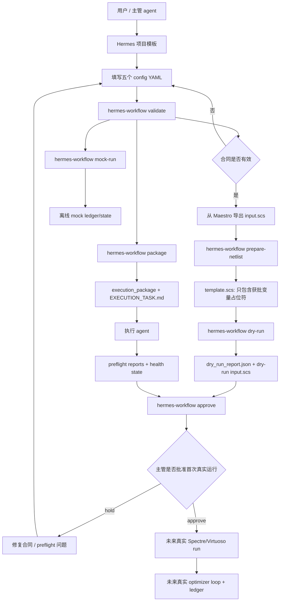

# IC Auto Opt Workflow 项目说明

## 当前项目节点

截至 2026-05-30：

- Plan A Hermes File Contract MVP 已完成到 Task 9。Hermes 部分没有 Plan A Task 10。
- Plan B mock optimization loop 已完成并提交。
- Plan C C-1 netlist template contract 已完成并提交。
- Plan C C-2 dry-run candidate renderer 已完成设计 spec 和 implementation plan，但尚未开始编码。
- 顶层 broad plan 已对齐当前路线：Hermes 负责 deterministic preflight，执行 agent 负责 Maestro export 和 approval 之后的真实 Spectre/optimizer 执行。
- 下一步开发入口是 `docs/superpowers/plans/2026-05-30-dry-run-candidate-renderer.md` 的 C-2 Task 1。
- `/home/zzchen/Agent_virtuoso/EDA_AI_AGENT/netlist_example` 下的真实 `input.scs` 示例只作为本地参考，不能提交进仓库。

## 1. 项目概览

本项目的目标，是把 IC 仿真优化从“靠 agent 读 skill 后临场发挥”的流程，升级成一个可验证、可复用、可审计的 Hermes 文件合同工作流。

`virtuoso-bridge-lite` 仍然是 Virtuoso/Spectre 能力层：它负责提供和 Cadence 工具交互的 skill、脚本和桥接能力。`ic-auto-opt-workflow` 则是它上面的一层流程约束：定义 YAML 合同、验证合同、生成执行包、准备 netlist 模板、读取 preflight report、控制首次真实仿真的 supervisor approval，并为未来真实优化循环提供状态和 ledger 结构。

当前路线明确把 `prepare-netlist` 和计划中的 `dry-run` 放在 Hermes deterministic preflight 内，而不是让执行 agent 每次在 execution package 中重新编写 `render_netlist.py` 或 `dry_run.py`。执行 agent 的边界保留在工具侧动作：Maestro export、真实 Spectre run、真实 optimizer loop 和真实 metric extraction。



## 2. 已开发内容在工作流中的位置

### 项目合同层

- `src/hermes_workflow/schemas.py`
  定义五个核心 YAML 的 Pydantic schema：`project_config.yaml`、`variables.yaml`、`metrics.yaml`、`spectre.yaml`、`optimizer.yaml`。同时也定义 optimizer state、ledger row、best candidate 等后续运行状态模型。

- `src/hermes_workflow/validate.py`
  负责加载并验证五个 YAML。它不仅验证单文件 schema，也验证跨文件引用，例如 objective 表达式中的 metric 名称、变量 range、单位一致性、netlist 路径安全边界等。

### 项目生成与执行包层

- `src/hermes_workflow/package.py`
  实现 `hermes-workflow init` 和 `hermes-workflow package` 的核心逻辑。它可以生成项目模板，复制不可变 config 到 `execution_package/config`，写入 `execution_manifest.json`，并渲染 `EXECUTION_TASK.md`。

- `src/hermes_workflow/templates/spectre_maestro_project/`
  当前唯一的项目模板来源。Task 4 已经锁定为 packaged resource，避免顶层模板和包内模板分叉。

### Preflight report 与主管审批层

- `src/hermes_workflow/reports.py`
  定义 netlist preparation、dry run、health check 三类 report 的严格模型，并通过 `load_preflight_reports()` 聚合 readiness message。

- `src/hermes_workflow/approvals.py`
  根据 config、preflight reports 和 health state 生成 supervisor instruction。只有所有前置检查通过时，才会给出首次真实运行批准。

### Netlist 准备层

- `src/hermes_workflow/netlists.py`
  对应 Plan C C-1。它从 `netlists/exported/input.scs` 读取 Maestro 导出的 Spectre deck，只改写顶层 `parameters` statement 中获批变量的 RHS，把它们替换成 `{{VARIABLE_NAME}}`。它不会修改 device、subckt、source、analysis、include、model、save 等其它语句。

- `hermes-workflow prepare-netlist`
  调用上述逻辑，生成 `netlists/templates/template.scs` 和 `reports/netlist_preparation_report.json`。

### Dry-run candidate renderer 层

- `docs/superpowers/specs/2026-05-30-dry-run-candidate-renderer-design.md`
  C-2 设计文档，定义 dry-run 的边界：渲染一个 lower-bound candidate、检查 placeholder/mock metric/objective/constraint/writability，不运行 Spectre/Virtuoso/optimizer loop。

- `docs/superpowers/plans/2026-05-30-dry-run-candidate-renderer.md`
  C-2 implementation plan。计划新增 `src/hermes_workflow/dry_run.py` 和 `hermes-workflow dry-run`，但当前还没有开始编码。

### Mock optimization 测试层

- `src/hermes_workflow/mock_optimizer.py`
  对应 Plan B。它实现离线 mock optimizer：生成 deterministic candidates、计算 mock metrics、评估 objective 和 constraints、写 ledger、写 optimizer state、写 best candidate、写 health check。

这不是未来真实 Spectre loop，而是一个 workflow test harness。它的价值是，在没有真实仿真接入前，先验证合同、状态、ledger、审批门能否支撑一个优化形态的流程。

### CLI 层

- `src/hermes_workflow/cli.py`
  当前提供：
  `init`、`validate`、`prepare-netlist`、`package`、`approve`、`mock-run`。

- C-2 计划新增：
  `dry-run`。

### Review gate 工具层

- `tools/claude_review_mcp.py`
  项目内单文件 MCP server，封装 Claude CLI 做 spec review 和 code-quality review。

- `docs/CLAUDE_REVIEW_MCP.md`
  记录 Claude review MCP 的使用方式和注册信息。

## 3. 完整构建后用户如何配置并使用

安装或在仓库内开发模式运行：

```bash
pip install -e .
```

创建一个优化项目：

```bash
hermes-workflow init projects/bridge_test_inv
```

编辑五个合同文件：

```text
projects/bridge_test_inv/config/project_config.yaml
projects/bridge_test_inv/config/variables.yaml
projects/bridge_test_inv/config/metrics.yaml
projects/bridge_test_inv/config/spectre.yaml
projects/bridge_test_inv/config/optimizer.yaml
```

验证合同：

```bash
hermes-workflow validate projects/bridge_test_inv
```

从 Maestro 导出或放置 Spectre deck：

```text
projects/bridge_test_inv/netlists/exported/input.scs
```

准备安全 netlist 模板：

```bash
hermes-workflow prepare-netlist projects/bridge_test_inv
```

C-2 完成后，执行 deterministic dry-run：

```bash
hermes-workflow dry-run projects/bridge_test_inv
```

生成给执行 agent 的执行包：

```bash
hermes-workflow package projects/bridge_test_inv
```

执行 agent 消费：

```text
projects/bridge_test_inv/execution_package/EXECUTION_TASK.md
projects/bridge_test_inv/execution_package/execution_manifest.json
projects/bridge_test_inv/execution_package/config/*.yaml
```

Hermes 读取 preflight reports 并给出 supervisor decision：

```bash
hermes-workflow approve projects/bridge_test_inv
```

如果只想离线测试流程，不跑 Virtuoso/Spectre：

```bash
hermes-workflow mock-run projects/bridge_test_inv --max-evaluations 4
```

未来真实运行接入后，真实 Spectre/Virtuoso run 应该放在 `approve` 之后，并继续通过同一套 schema、ledger、state、report 结构写入可审计结果。

## 4. 能否严格约束主管 agent 和执行 agent 的行为

本项目可以在 workflow 边界上强约束 agent 行为，但它本身不是一个完整安全沙箱。

它已经提供的约束包括：

- 用 typed YAML contract 替代自由文本任务描述。
- 明确 whitelisted variables，只有这些变量允许被模板化。
- netlist preparation 只允许改写顶层 Spectre `parameters` 中获批变量的 RHS。
- execution package 带 manifest 和 hash，便于检查输入是否被篡改。
- 首次真实运行前必须有 preflight reports。
- supervisor approval 依赖机器可读 report，而不是依赖 agent 的口头承诺。
- 真实仿真运行被放在显式 approval gate 之后。

如果要做到生产意义上的“严格”，还需要运行环境配合：

- 执行 agent 只能访问 execution package 和允许写入的 project 子目录。
- CI 或 supervisor 必须拒绝缺失、格式错误或失败状态的 report。
- 文件权限或 sandbox 应阻止 agent 修改 immutable package 输入。
- Spectre/Virtuoso 真实命令应只能通过受控 workflow entry point 触发。

所以更准确地说：本项目提供合同、状态机、报告和审批门；运行环境权限让这些门真正不可绕过。

## 5. 相比只使用 `virtuoso-bridge-lite` skills 的定位和优势

只让 agent 加载 `virtuoso-bridge-lite` skills，是最快的一次性实验方式。它适合探索、调试、临时操作，也适合人类在旁边持续监督的场景。

但如果每次新仿真优化都只靠 skill，agent 很容易重新设计一套变量定义、netlist 改写、候选生成、状态记录、审批门和报告格式。这就是“每次重新造轮子”的风险。

本项目的定位，是把这些容易反复发明、容易漏掉、又需要审计的部分固化成代码和文件合同。

相比 skills-only，本项目改善：

- 复用性：项目模板、schema、CLI、report、manifest 可以跨新项目复用。
- 确定性：dry-run candidate、mock run、manifest hash、report schema 都可以复现。
- 可审计性：主管 agent 检查文件和 report，而不是只读聊天记录。
- 安全性：变量白名单、模板边界、首次真实运行审批和 immutable manifest 降低误改 Maestro/Spectre setup 的风险。
- 可交接性：另一个 agent 可以从 progress docs、plans、commits、reports 恢复上下文。
- 可测试性：pytest 和 ruff 可以在没有 Virtuoso/Spectre 的环境中验证 workflow 本身。

因此两者不是替代关系。`virtuoso-bridge-lite` skills 是底层执行能力；`ic-auto-opt-workflow` 是告诉 agent 何时、以什么输入、在什么审批状态下使用这些能力的流程外壳。
