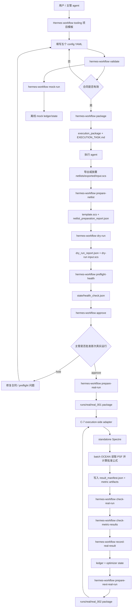

# IC Auto Opt Workflow 项目说明

## 当前项目节点

截至 2026-06-03：

- Plan A Hermes File Contract MVP 已完成到 Task 9。Hermes 部分没有 Plan A Task 10。
- Plan B mock optimization loop 已完成并提交。
- Plan C C-1 netlist template contract 已完成并提交。
- Plan C C-2 dry-run candidate renderer 已完成并通过最终 review gate。
- Plan C C-3 execution package preflight readiness 已完成并通过最终 review gate：生成的 execution package 将 Maestro export 分配给执行 agent，Hermes workflow tooling 拥有 `prepare-netlist`、`dry-run`、`preflight-health` 和 `approve`。
- Plan C C-4 post-approval real-run execution contract 已完成并通过合并 final review gate：Hermes workflow tooling 已具备 post-approval guard、immutable config drift guard、first real-run package rendering、candidate/manifest 写入、overwrite refusal、失败清理测试覆盖，以及 `hermes-workflow prepare-real-run` CLI。C-4 只准备真实 run package，不运行 Spectre。
- Plan C C-5 real-run result handoff contract 已完成并通过 final review gate：Hermes workflow tooling 已具备 returned `result_manifest.json` 验证、prepared input hash attestation、artifact path safety check、`reports/real_run_check_report.json` 写入，以及 `hermes-workflow check-real-run` CLI。C-5 不运行 Spectre，不解析真实指标，不写 optimizer ledger/state。
- Plan C C-5.5 dual-agent result handoff simulation gate 已完成并通过：模拟 execution-agent 和 Hermes workflow observer，验证 C-4/C-5 的 returned result package 行为边界。
- Spectre + OCEAN backend 已通过真实工具链证据验证：Maestro point-level PSF 和 standalone Spectre replay PSF 均可被 batch OCEAN 打开并得到一致 scalar metric。
- Plan C C-6 Spectre + OCEAN real metric result contract 已完成并通过 final combined review gate：`metrics.yaml` 支持精确批准的 OCEAN 公式，`prepare-real-run` 写入 `metric_extraction_request.json`，returned handoff 可引用 PSF/metric artifacts，`hermes-workflow check-metric-results` 验证公式身份、request hash、scalar 值和 artifact path。
- Plan C C-7 Spectre + OCEAN execution adapter 已完成并通过 final combined review gate：新增 execution-side adapter library、fake-runner orchestration、failure/overwrite safety、explicit `tools/run_spectre_ocean_adapter.py` entry point。自动测试使用 fake runner；真实 Cadence smoke 仍然只作为 local-only evidence。
- Plan C C-8 real result ledger/state update 已完成并通过 final review gate：`hermes-workflow record-real-result` 在 `check-real-run` 和 `check-metric-results` 通过后，将 checked real metric result 写入 `ledger/experiment_ledger.jsonl`、`state/optimizer_state.json` 和 ledger-derived best candidate。C-8 仍是 contract-only，不运行真实工具，不解析 PSF，不重写公式，不生成下一候选。
- Plan C C-9 next real-run package contract 已完成并通过 final review gate：`hermes-workflow prepare-next-real-run` 在 C-8 已记录 checked real result 之后，按 optimizer config 的 deterministic initialization sequence 选择下一唯一候选，生成新的 C-4/C-6-compatible real-run package。C-9 不运行真实工具，不调用 C-7 adapter，不写 ledger/state，不解析 PSF，不改写公式，并 fail-closed 拒绝 symlinked real-run directories。
- Plan C C-10 real-run failure/retry policy contract 已完成并通过 final verification/review gate：Hermes workflow tooling 可通过 `assess-real-run-recovery` 对 pending/failed/partial/metric-failed/recordable/recorded/resolved run 做 deterministic classification，通过 `prepare-real-run-retry` 为同一 candidate 准备新的 retry package，通过 `resolve-real-run-failure` 写入 abandon/stop/revise decision，并在 C-9 前阻塞 unresolved real-run package。C-10 仍是 contract-only，不运行真实工具，不调用 C-7 adapter，不写 ledger/state，不解析 PSF，不改写公式。
- 角色模型已锁定在 `docs/ROLE_MODEL_AND_TERMINOLOGY.md`：主管 agent 负责规划、审批和读取 Hermes workflow report；Hermes workflow tooling 是 deterministic file-contract 与 validation 工具层；执行 agent 负责 Maestro export、approval 之后的 standalone Spectre、batch OCEAN metric extraction，以及后续被批准的 optimizer/tool-side 操作。
- 仓库级 agent/coding 约束已写入 `AGENTS.md`：后续压缩上下文或更换 agent 时，必须先读取该文件，保持角色模型、contract-only 边界、公式安全和简洁外科式改动规则不漂移。
- C-11 local/fake controlled smoke 已完成并 reviewed：`tests/test_local_real_run_smoke.py` 串联 C-9 -> fake C-7-style returned artifacts -> C-5/C-6 checks -> C-8 happy path，并包含一个受控 C-10 failure/retry case；Task 4 还新增了窄 CLI smoke 覆盖 `prepare-next-real-run`、`check-real-run`、`check-metric-results` 和 `record-real-result` 的 supervisor-facing 输出。下一步是选择下一轮真实工具/agent practice scope，并先写/批准 design spec。C-11 smoke 仍然只使用 fake/local controlled flow，不直接真实接入 Virtuoso/Spectre/OCEAN/agent。
- C-12 controlled real-tool/agent practice design spec 已批准并进入执行：`docs/superpowers/specs/2026-06-03-controlled-real-tool-agent-practice-design.md`。C-12 被限定为一个已知 cell、一个 approved real-run package、一次 execution-agent/C-7 adapter 调用，然后通过 Hermes `check-real-run`、`check-metric-results`、`record-real-result` 验证和记录。真实工具执行仍必须等 Task 3 前的明确用户确认。
- C-12 implementation plan 已批准并执行到 Task 3：`docs/superpowers/plans/2026-06-03-controlled-real-tool-agent-practice.md`。计划分为本地 workspace/input gate、Hermes preflight/package、用户确认后的 C-7 adapter 真工具调用、Hermes check/record/recovery、sanitized evidence/final gate 五个任务。
- C-12 Task 3 execution-agent/C-7 adapter invocation 已完成并 reviewed：用户明确确认后，adapter 对 `/tmp/ic_auto_opt_c12/bridge_test_inv/runs/real/real_001` 运行，写出了 failed `result_manifest.json` 和本地 hash evidence；没有产生 metric manifest 或 OCEAN scalar 输出。`spectre.stdout` 报 `SPECTRE-132`，原因是当前 adapter 的 `-log psf/spectre.out` 参数在该 Spectre 调用中被解释为第二个 input file。下一步必须由用户确认：进入 C-12 Task 4 Hermes check/recovery 合同验证，或先开一个 scoped C-7 adapter command-compatibility fix。
- `/home/zzchen/Agent_virtuoso/EDA_AI_AGENT/netlist_example` 下的真实 `input.scs` 示例只作为本地参考，不能提交进仓库。

## 1. 项目概览

本项目的目标，是把 IC 仿真优化从“靠 agent 读 skill 后临场发挥”的流程，升级成一个可验证、可复用、可审计的 Hermes 文件合同工作流。

`virtuoso-bridge-lite` 仍然是 Virtuoso/Spectre/OCEAN 能力层：它负责提供和 Cadence 工具交互的 skill、脚本和桥接能力。`ic-auto-opt-workflow` 则是它上面的一层流程约束：定义 YAML 合同、验证合同、生成执行包、准备 netlist 模板、读取 preflight report、控制首次真实仿真的 supervisor approval，并为未来真实优化循环提供状态和 ledger 结构。

角色模型已锁定：主管 agent 是规划和决策 agent；Hermes workflow tooling 是本仓库内的 deterministic file-contract 与 validation 工具层，不再表示一个本地部署的 Hermes agent；执行 agent 是工具侧 agent，可以由 Claude CLI、其它 agent runtime、脚本 worker 或未来 `virtuoso-bridge-lite` adapter 承担。执行 agent 负责导出或放置 `input.scs`，并且仅在 `approve_first_real_run` 之后运行 standalone Spectre，再通过 batch OCEAN 执行用户/项目批准的精确 metric formula。主管 agent 只能依据 Hermes workflow tooling 的机器可读 report 推进流程；Python 不解析 PSF，不重写 Calculator/OCEAN 公式。

该角色约定的规范文档是：

- `docs/ROLE_MODEL_AND_TERMINOLOGY.md`



## 2. 已开发内容在工作流中的位置

### 项目合同层

- `src/hermes_workflow/schemas.py`
  定义五个核心 YAML 的 Pydantic schema：`project_config.yaml`、`variables.yaml`、`metrics.yaml`、`spectre.yaml`、`optimizer.yaml`。同时也定义 optimizer state、ledger row、best candidate 等后续运行状态模型。

- `src/hermes_workflow/validate.py`
  负责加载并验证五个 YAML。它不仅验证单文件 schema，也验证跨文件引用，例如 objective 表达式中的 metric 名称、变量 range、单位一致性、netlist 路径安全边界等。

### Preflight health 层

- `src/hermes_workflow/health.py`
  对应 Plan C C-3。它在首次真实运行审批前写入 `state/health_check.json`，并在发现 pre-approval real-run artifacts 时 fail closed，让 `approve` 继续通过机器可读 health report 拒绝流程。

### 项目生成与执行包层

- `src/hermes_workflow/package.py`
  实现 `hermes-workflow init` 和 `hermes-workflow package` 的核心逻辑。它可以生成项目模板，复制不可变 config 到 `execution_package/config`，写入 `execution_manifest.json`，并渲染 `EXECUTION_TASK.md`。

- `src/hermes_workflow/templates/spectre_maestro_project/`
  当前唯一的项目模板来源。Task 4 已经锁定为 packaged resource，避免顶层模板和包内模板分叉。

### Preflight report 与主管审批层

- `src/hermes_workflow/reports.py`
  定义 netlist preparation、dry run、health check、real-run result handoff report 的严格模型，并通过 `load_preflight_reports()` 聚合 readiness message。

- `src/hermes_workflow/approvals.py`
  根据 config、preflight reports 和 health state 生成 supervisor instruction。只有所有前置检查通过时，才会给出首次真实运行批准。

### Netlist 准备层

- `src/hermes_workflow/netlists.py`
  对应 Plan C C-1。它从 `netlists/exported/input.scs` 读取 Maestro 导出的 Spectre deck，只改写顶层 `parameters` statement 中获批变量的 RHS，把它们替换成 `{{VARIABLE_NAME}}`。它不会修改 device、subckt、source、analysis、include、model、save 等其它语句。

- `hermes-workflow prepare-netlist`
  调用上述逻辑，生成 `netlists/templates/template.scs` 和 `reports/netlist_preparation_report.json`。

### Dry-run candidate renderer 层

- `docs/superpowers/specs/2026-05-30-dry-run-candidate-renderer-design.md`
  C-2 设计文档，定义 dry-run 的边界：渲染一个 lower-bound candidate、检查 placeholder/mock metric/objective/constraint/writability，不运行 Spectre/Virtuoso/optimizer loop。

- `docs/superpowers/plans/2026-05-30-dry-run-candidate-renderer.md`
  C-2 implementation plan。当前已完成，新增了 `src/hermes_workflow/dry_run.py` 和 `hermes-workflow dry-run`。

- `src/hermes_workflow/dry_run.py`
  渲染一个 lower-bound candidate，检查 placeholder、mock metric、objective、constraint evaluability、`ledger/` 和 `state/` writability，并写入 `reports/dry_run_report.json`。

### Post-approval real-run package 层

- `docs/superpowers/specs/2026-05-31-post-approval-real-run-contract-design.md`
  C-4 设计文档，定义 approval 之后、真实 Spectre runner 之前的文件合同边界：Hermes 只准备 first real-run package，不启动 Spectre/Virtuoso/subprocess/optimizer loop。

- `docs/superpowers/plans/2026-06-01-post-approval-real-run-contract.md`
  C-4 implementation plan。当前 C-4 已完成并通过 final verification 与合并 review gate。

- `src/hermes_workflow/real_run.py`
  验证 `supervisor_instruction.json` 已批准首次真实运行，校验 immutable config hash 未漂移，从 `template.scs` 渲染 lower-bound first real candidate，写入 `runs/real/<run_id>/input.scs`、`candidate.json` 和 `real_run_manifest.json`，并在失败时清理 partial run directory。

- `hermes-workflow prepare-real-run`
  调用上述逻辑，准备后续真实 simulator runner 可消费的文件合同。它不运行 Spectre。

### Real-run result handoff 层

- `docs/superpowers/specs/2026-06-01-real-run-result-handoff-contract-design.md`
  C-5 设计文档，定义执行 agent 消费 first real-run package 之后返回给 Hermes 的文件合同：`result_manifest.json`、sanitized logs/artifacts、prepared input hash attestation 和 artifact path safety。

- `docs/superpowers/plans/2026-06-01-real-run-result-handoff-contract.md`
  C-5 implementation plan。当前 C-5 已完成并通过 final verification/review gate，C-5.5 simulation gate 待执行。

- `src/hermes_workflow/result_handoff.py`
  验证 `runs/real/<run_id>/result_manifest.json` 是否匹配 C-4 的 `real_run_manifest.json` 和 `candidate.json`，确认 `input.scs` hash 未漂移，拒绝 absolute/path traversal/out-of-run artifact paths，并写入 `reports/real_run_check_report.json`。

- `hermes-workflow check-real-run`
  调用上述逻辑，报告 returned handoff pass/fail。它不启动 Spectre，不解析 simulator database，不计算真实 metric，不写 ledger 或 optimizer state。

### Spectre + OCEAN metric result contract 层

- `src/hermes_workflow/metric_requests.py`
  在 `prepare-real-run` 阶段生成 `runs/real/<run_id>/metric_extraction_request.json`。该文件把 `metrics.yaml` 中用户/项目批准的精确 OCEAN 公式、result selector、unit、failure policy 和 formula hash 交给执行 agent。Hermes 不在这里调用 OCEAN。

- `src/hermes_workflow/metric_results.py`
  验证 OCEAN scalar metric artifacts 是否匹配 `metric_extraction_request.json` 和 C-5 `result_manifest.json`，包括 request hash、formula text/hash、metric set、scalar finite value、PSF/OCEAN artifact path，以及 canonical `input.scs` hash。它不读取 PSF，不解析 waveform，不重新实现 Calculator/OCEAN 公式。

- `hermes-workflow check-metric-results`
  调用上述逻辑，写入 `reports/metric_result_check_report.json`。它只验证执行 agent 返回的 OCEAN scalar manifest，不启动 Spectre/OCEAN，不写 optimizer ledger/state。

### Real result ledger/state 层

- `src/hermes_workflow/real_result_record.py`
  对应 Plan C C-8。它在 `check-real-run` 和 `check-metric-results` 都通过后，从 checked metric report 中读取有限 scalar metric，从 `candidate.json` 读取参数，按 `metrics.yaml` 评估 objective/constraints，并追加一条 real-result ledger row。它同时更新 `state/optimizer_state.json`，在可行且更优时更新 `state/best_candidate.json`。它不运行 Spectre/OCEAN，不解析 PSF，不生成下一候选。

- `hermes-workflow record-real-result`
  调用上述逻辑，写入 `reports/real_result_record_report.json`。失败时 fail closed，不追加 ledger，不写 optimizer state，不用旧 checker report 代替 fresh check。

### Next real-run package 层

- `src/hermes_workflow/real_run.py`
  对应 Plan C C-9。除了 C-4 的 `prepare_real_run()` first-run package 之外，它现在提供 `prepare_next_real_run()`：读取严格 ledger 和 optimizer state，验证 immutable config 未漂移，按 optimizer config 的 deterministic initialization sequence 选择下一唯一候选，并写入新的 `runs/real/<run_id>/` package。它不运行真实工具，不调用 C-7 adapter，不写 ledger/state，不解析 PSF，不改写 OCEAN 公式。

- `hermes-workflow prepare-next-real-run`
  调用上述逻辑，在已经通过 C-8 记录 checked real result 后准备下一次真实运行 package。默认选择最小未占用 `real_###` 目录，显式 `--run-id` 会拒绝 `real_001` 和已存在 package/非空 partial 目录。

### Real-run failure/retry policy 层

- `src/hermes_workflow/reports.py`
  对应 Plan C C-10 Task 1。它定义 recovery report 的 strict enum/model：recovery assessment 的 `status`、classification、allowed actions、recommended action、attempt budget、source report paths 和 issue list 都必须落在机器可读合同内。

- `src/hermes_workflow/real_run_recovery.py`
  对应 Plan C C-10 Task 2-3。它提供 `assess_real_run_recovery()`、`prepare_real_run_retry()` 和 `resolve_real_run_failure()`：基于文件状态、既有 checker report 和 ledger state 对 pending/failed/partial/metric-failed/recordable/recorded/resolved run 做 deterministic classification；从 explicit supervisor decision 写入 `runs/real/<run_id>/recovery_decision.json`；为同一 `candidate_id` 准备新的 retry run package，并保留失败 run 的 `input.scs`、metric formula contract 和 evidence。它拒绝 retry target 覆盖、leaf/parent symlink、dangling decision symlink、公式合同不一致和超出 retry budget。

- C-10 CLI 和状态
  `hermes-workflow assess-real-run-recovery`、`prepare-real-run-retry` 和 `resolve-real-run-failure` 已接入上述 recovery logic。CLI pass/fail paths 会输出 report path、classification、decision/package path 或 recovery issues，并避免 traceback。C-10 Task 4 已在 C-9 `prepare-next-real-run` 前加入 unresolved real-run guard：pending、failed、partial、metric-failed、retry-prepared、stopped、contract-invalid 或 recordable 但未记录的 real-run package 会阻塞 C-9；already-recorded 和 resolved-abandoned 会放行；retry-prepared source run 会等 retry run 被记录或 resolved abandoned 后放行。

### Spectre + OCEAN execution adapter 层

- `src/hermes_workflow/execution_adapters/spectre_ocean.py`
  对应 Plan C C-7。它消费已批准的 `runs/real/<run_id>/` package，通过 injectable runner 调用 standalone Spectre 和 batch OCEAN，生成 `metrics/metric_probe.ocn`，只解析 OCEAN 写出的 `metrics/ocean_scalars.tsv`，并写入 C-5/C-6 兼容的 `result_manifest.json` 与 `metrics/metric_result_manifest.json`。它不解析 PSF，不改写公式。

- `tools/run_spectre_ocean_adapter.py`
  execution-side 显式工具入口。它不是 `hermes-workflow` validator 命令；执行 agent 在 approval 和 `prepare-real-run` 之后调用它。主管 agent 仍必须在 adapter 返回后运行 `check-real-run` 和 `check-metric-results`。

### Spectre + OCEAN metric backend 证据层

- `docs/toolchain_evidence/2026-06-01-spectre-ocean-bridge-smoke/`
  使用 `Virtuoso_Bridge_test/bridge_test_inv` 验证 transient/DC 路径：Maestro point-level PSF 和 standalone Spectre replay PSF 均可由 batch OCEAN 打开，`rise`、`fall`、`DC` scalar 结果一致。

- `docs/toolchain_evidence/2026-06-01-pss-pac-directplot-ocean-probe/`
  使用 `Virtuoso_Bridge_test/Mixer_PSS_CG_Noise` 验证 PSS/PAC/PNoise 路径：Maestro point-level PSF 和 standalone Spectre replay PSF 均可由 batch OCEAN 打开，`BW`、`MAX_GAIN` scalar 结果一致。`drplPacVolGnExpDen` 在 batch OCEAN 中可用，但公式不能由 agent 自行改写；以 `metrics.yaml` 中批准的精确公式为准。

### Mock optimization 测试层

- `src/hermes_workflow/mock_optimizer.py`
  对应 Plan B。它实现离线 mock optimizer：生成 deterministic candidates、计算 mock metrics、评估 objective 和 constraints、写 ledger、写 optimizer state、写 best candidate、写 health check。

这不是未来真实 Spectre loop，而是一个 workflow test harness。它的价值是，在没有真实仿真接入前，先验证合同、状态、ledger、审批门能否支撑一个优化形态的流程。

### CLI 层

- `src/hermes_workflow/cli.py`
  当前提供：
  `init`、`validate`、`prepare-netlist`、`dry-run`、`preflight-health`、`package`、`approve`、`prepare-real-run`、`prepare-next-real-run`、`assess-real-run-recovery`、`prepare-real-run-retry`、`resolve-real-run-failure`、`check-real-run`、`check-metric-results`、`record-real-result`、`mock-run`。

### Review gate 工具层

- `tools/claude_review_mcp.py`
  项目内单文件 MCP server，封装 Claude CLI 做 spec review 和 code-quality review。

- `docs/CLAUDE_REVIEW_MCP.md`
  记录 Claude review MCP 的使用方式和注册信息。

## 3. 完整构建后用户如何配置并使用

安装或在仓库内开发模式运行：

```bash
pip install -e .
```

创建一个优化项目：

```bash
hermes-workflow init projects/bridge_test_inv
```

编辑五个合同文件：

```text
projects/bridge_test_inv/config/project_config.yaml
projects/bridge_test_inv/config/variables.yaml
projects/bridge_test_inv/config/metrics.yaml
projects/bridge_test_inv/config/spectre.yaml
projects/bridge_test_inv/config/optimizer.yaml
```

验证合同：

```bash
hermes-workflow validate projects/bridge_test_inv
```

从 Maestro 导出或放置 Spectre deck：

```text
projects/bridge_test_inv/netlists/exported/input.scs
```

准备安全 netlist 模板：

```bash
hermes-workflow prepare-netlist projects/bridge_test_inv
```

执行 deterministic dry-run：

```bash
hermes-workflow dry-run projects/bridge_test_inv
```

执行 preflight health 检查：

```bash
hermes-workflow preflight-health projects/bridge_test_inv
```

生成给执行 agent 的执行包：

```bash
hermes-workflow package projects/bridge_test_inv
```

执行 agent 消费：

```text
projects/bridge_test_inv/execution_package/EXECUTION_TASK.md
projects/bridge_test_inv/execution_package/execution_manifest.json
projects/bridge_test_inv/execution_package/config/*.yaml
```

Hermes 读取 preflight reports 并给出 supervisor decision：

```bash
hermes-workflow approve projects/bridge_test_inv
```

批准后准备 first real-run package：

```bash
hermes-workflow prepare-real-run projects/bridge_test_inv
```

`prepare-real-run` 会写入 `runs/real/real_001/`，但不会运行 Spectre、Virtuoso、subprocess 或 optimizer loop。

执行 agent 通过 C-7 显式 adapter 在 Hermes validators 外部运行准备好的 deck：

```bash
python tools/run_spectre_ocean_adapter.py projects/bridge_test_inv --run-id real_001
```

该 adapter 写入：

```text
projects/bridge_test_inv/runs/real/real_001/result_manifest.json
projects/bridge_test_inv/runs/real/real_001/spectre.stdout
projects/bridge_test_inv/runs/real/real_001/spectre.stderr
projects/bridge_test_inv/runs/real/real_001/psf/
projects/bridge_test_inv/runs/real/real_001/metrics/metric_result_manifest.json
projects/bridge_test_inv/runs/real/real_001/metrics/ocean_scalars.tsv
```

Hermes 验证返回文件合同：

```bash
hermes-workflow check-real-run projects/bridge_test_inv
```

`check-real-run` 只验证 returned file contract。它不启动 Spectre，不解析真实仿真结果，不计算真实 metric，不写 ledger 或 optimizer state。

Hermes 验证 OCEAN scalar metric artifacts：

```bash
hermes-workflow check-metric-results projects/bridge_test_inv
```

`check-metric-results` 验证 `metric_result_manifest.json`、request hash、公式文本/hash、scalar 有限性和 artifact path。Hermes 不读取 PSF，不解析 waveform，不把 Calculator/OCEAN 公式翻译成 Python。

Hermes 将 checked real result 记录进 optimizer ledger/state：

```bash
hermes-workflow record-real-result projects/bridge_test_inv --run-id real_001
```

`record-real-result` 只消费已经通过 `check-real-run` 与 `check-metric-results` 的文件合同。它追加 `ledger/experiment_ledger.jsonl`，更新 `state/optimizer_state.json`，并在可行且更优时更新 `state/best_candidate.json`。它不运行 Spectre/OCEAN，不解析 PSF，不生成下一候选。

Hermes 根据已记录的 real-result ledger/state 准备下一候选 package：

```bash
hermes-workflow prepare-next-real-run projects/bridge_test_inv
```

`prepare-next-real-run` 选择下一唯一候选并写入 `runs/real/real_002/` 等新 package。它只准备文件合同，不运行 Spectre/OCEAN，不调用 C-7 adapter，不写 ledger/state。执行 agent 随后仍通过 `tools/run_spectre_ocean_adapter.py --run-id real_002` 运行真实工具，主管 agent 仍必须继续执行 `check-real-run`、`check-metric-results` 和 `record-real-result`。

如果只想离线测试流程，不跑 Virtuoso/Spectre：

```bash
hermes-workflow mock-run projects/bridge_test_inv --max-evaluations 4
```

未来真实运行接入后，真实 Spectre/OCEAN run 应该放在 `approve` 和 `prepare-real-run` 之后，并继续通过同一套 schema、ledger、state、report 结构写入可审计结果。

C-5.5 已在真实工具 adapter 前验证双 agent 行为：一个模拟 execution-agent 写 returned result package，另一个模拟 Hermes/supervisor 只相信 `check-real-run` 的机器可读报告。

C-6 已把 Spectre + OCEAN metric result contract 固化进项目文件：`metrics.yaml` 中的公式为权威输入；Maestro/ADE 读取出来的公式只能作为草稿；执行 agent 必须原样交给 OCEAN 计算；Hermes 只验证结果文件合同和 scalar/provenance，不在 Python 中计算 PSF。C-6 也将真实 metric extraction 的 OCEAN-readable PSF 格式收敛到 `psfxl` 路线；历史 `psfascii` 只保留为旧合同允许值，不是 C-6 真实 OCEAN metric backend 的 ready format。

C-7 已将 physical tool boundary 接到 execution agent 侧：`supervisor agent -> Hermes workflow tooling -> execution agent -> C-7 adapter -> Hermes workflow checks`。自动化测试只使用 fake runners；真实 Cadence smoke 继续保留在 local-only evidence 目录，不作为 CI 前提。

C-8 已把 checked real result 接入 optimizer ledger/state：`check-real-run -> check-metric-results -> record-real-result`。它仍然保持 Hermes workflow tooling 的 contract-only 边界，只记录已由 OCEAN 计算并由 checker 验证的 scalar/provenance。

C-9 已把下一真实候选 package 接入 workflow：`record-real-result -> prepare-next-real-run -> C-7 execution adapter`。它使用 deterministic initialization sequence + strict dedupe 生成下一 package，但仍然不运行真实工具、不写 ledger/state。

C-10 已完成 implementation。它是进入真实工具 smoke 前的 failure/retry 安全层：failed/partial/pending real-run package 必须先被 deterministic recovery assessment 和 explicit supervisor decision 处理，C-9 才能继续推进。C-10 增加了 supervisor-facing CLI：

```bash
hermes-workflow assess-real-run-recovery projects/bridge_test_inv --run-id real_002
hermes-workflow prepare-real-run-retry projects/bridge_test_inv --failed-run-id real_002
hermes-workflow resolve-real-run-failure projects/bridge_test_inv --run-id real_002 --decision abandon_candidate --reason "skip failed candidate"
```

C-11 local/fake controlled smoke 已完成并 reviewed。它验证 C-9 -> fake C-7-style returned artifacts -> C-5/C-6 checks -> C-8 happy path 和一个 C-10 failure/retry path。C-12 controlled real-tool/agent practice design spec 和 implementation plan 已写好；当前 C-12 Task 3 已完成并 reviewed，真实 C-7 adapter 边界返回 failed `result_manifest.json`，暴露出 adapter Spectre log 参数兼容性问题。不要直接继续真实工具重跑；下一步需用户确认是进入 Task 4 failure/recovery 合同验证，还是先开一个 scoped C-7 adapter bugfix。

## 4. 能否严格约束主管 agent 和执行 agent 的行为

本项目可以在 workflow 边界上强约束 agent 行为，但它本身不是一个完整安全沙箱。

它已经提供的约束包括：

- 用 typed YAML contract 替代自由文本任务描述。
- 明确 whitelisted variables，只有这些变量允许被模板化。
- netlist preparation 只允许改写顶层 Spectre `parameters` 中获批变量的 RHS。
- execution package 带 manifest 和 hash，便于检查输入是否被篡改。
- 首次真实运行前必须有 preflight reports。
- supervisor approval 依赖机器可读 report，而不是依赖 agent 的口头承诺。
- 真实仿真运行被放在显式 approval gate 之后。
- metric formula 以文件合同中批准的精确表达式为准，禁止 agent 自动翻译或改写。
- OCEAN 负责计算真实 metric，Python 只记录 OCEAN 输出和 provenance。

如果要做到生产意义上的“严格”，还需要运行环境配合：

- 执行 agent 只能访问 execution package 和允许写入的 project 子目录。
- CI 或 supervisor 必须拒绝缺失、格式错误或失败状态的 report。
- 文件权限或 sandbox 应阻止 agent 修改 immutable package 输入。
- Spectre/Virtuoso 真实命令应只能通过受控 workflow entry point 触发。
- batch OCEAN 真实 metric extraction 也应只能通过受控 workflow entry point 触发。

所以更准确地说：本项目提供合同、状态机、报告和审批门；运行环境权限让这些门真正不可绕过。

## 5. 相比只使用 `virtuoso-bridge-lite` skills 的定位和优势

只让 agent 加载 `virtuoso-bridge-lite` skills，是最快的一次性实验方式。它适合探索、调试、临时操作，也适合人类在旁边持续监督的场景。

但如果每次新仿真优化都只靠 skill，agent 很容易重新设计一套变量定义、netlist 改写、候选生成、状态记录、审批门和报告格式。这就是“每次重新造轮子”的风险。

本项目的定位，是把这些容易反复发明、容易漏掉、又需要审计的部分固化成代码和文件合同。

相比 skills-only，本项目改善：

- 复用性：项目模板、schema、CLI、report、manifest 可以跨新项目复用。
- 确定性：dry-run candidate、mock run、manifest hash、report schema 都可以复现。
- 可审计性：主管 agent 检查文件和 report，而不是只读聊天记录。
- 安全性：变量白名单、模板边界、首次真实运行审批和 immutable manifest 降低误改 Maestro/Spectre setup 的风险。
- 可交接性：另一个 agent 可以从 progress docs、plans、commits、reports 恢复上下文。
- 可测试性：pytest 和 ruff 可以在没有 Virtuoso/Spectre 的环境中验证 workflow 本身。

因此两者不是替代关系。`virtuoso-bridge-lite` skills 是底层执行能力；`ic-auto-opt-workflow` 是告诉 agent 何时、以什么输入、在什么审批状态下使用这些能力的流程外壳。
