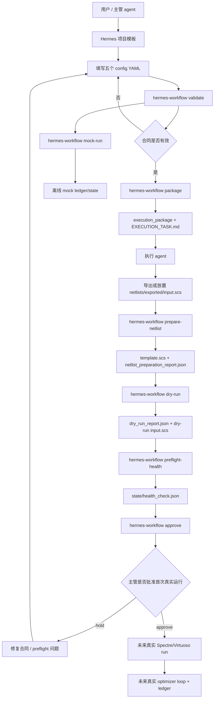

# Execution Package Preflight Readiness Implementation Plan

> **For agentic workers:** REQUIRED SUB-SKILL: Use superpowers:subagent-driven-development (recommended) or superpowers:executing-plans to implement this plan task-by-task. Steps use checkbox (`- [ ]`) syntax for tracking.

**Goal:** Align the generated execution package, Hermes preflight reports, and first-run approval gate so Hermes owns deterministic preflight readiness and the execution agent only exports `netlists/exported/input.scs` before approval.

**Architecture:** Keep the existing strict report models and approval gate. Add a focused `src/hermes_workflow/health.py` module that writes `state/health_check.json`, update `EXECUTION_TASK.md` text to stop assigning Hermes report creation to the execution agent, expose `hermes-workflow preflight-health`, and update docs so the file-contract route is consistent.

**Tech Stack:** Python 3.11+, Typer, Pydantic, pytest, ruff, existing Hermes validation/report/package/approval helpers, Claude CLI review gates.

---

## Execution Model

Use `superpowers:subagent-driven-development` for implementation. For each task:

1. Dispatch a fresh Claude CLI coding worker with only the current task section and this spec path:

```text
docs/superpowers/specs/2026-05-30-execution-package-preflight-readiness-design.md
```

2. Review the worker diff before continuing.
3. Run the task-specific pytest command.
4. Run `ruff check .`.
5. Run the review gate:

```bash
claude -p "Review the current git diff for C-3 Task N against docs/superpowers/specs/2026-05-30-execution-package-preflight-readiness-design.md. Focus on spec compliance and code quality. Return Critical, Important, Minor findings."
```

6. Fix all Critical and Important findings before moving to the next task.
7. Commit after the task is green.

Do not commit or copy real `input.scs` examples from `/home/zzchen/Agent_virtuoso/EDA_AI_AGENT/netlist_example`.

## File Map

- Modify `src/hermes_workflow/package.py`: update generated `EXECUTION_TASK.md` responsibility text.
- Modify `tests/test_package.py`: lock the execution task contract and required preflight report manifest paths.
- Create `src/hermes_workflow/health.py`: write healthy or fail-closed preflight health reports.
- Create `tests/test_health.py`: unit-test healthy health report writing, artifact detection, and invalid config behavior.
- Modify `src/hermes_workflow/cli.py`: add `preflight-health` command and update `approve` help text.
- Modify `tests/test_cli.py`: cover `preflight-health` success, failure, help text, and full CLI pre-approval flow.
- Modify `src/hermes_workflow/approvals.py`: update the approval reason string only.
- Modify `tests/test_approvals.py`: lock approval reason and health rejection behavior.
- Modify `README.md`: update MVP command sequence and responsibility language.
- Modify `docs/PROJECT_WORKFLOW_OVERVIEW.md`: add `preflight-health` to the diagram, module list, CLI list, and usage flow.
- Modify `docs/EXECUTION_PROGRESS_2026-05-29.md`: record Plan C-3 status, commits, verification, and resume prompt.
- Modify `docs/COMPACT_RESUME_CHECKPOINT.md`: record Plan C-3 as the active or completed checkpoint.

## Task 1: Execution Package Contract Text

**Files:**
- Modify: `src/hermes_workflow/package.py`
- Modify: `tests/test_package.py`

- [ ] **Step 1: Write failing tests for generated execution task ownership**

Append these assertions to `tests/test_package.py::test_build_execution_package_writes_execution_task`:

```python
    assert "Export or place the Spectre deck at `netlists/exported/input.scs`" in task_text
    assert "Do not write `reports/netlist_preparation_report.json`" in task_text
    assert "Do not write `reports/dry_run_report.json`" in task_text
    assert "Do not write `state/health_check.json`" in task_text
    assert "hermes-workflow prepare-netlist PROJECT_DIR" in task_text
    assert "hermes-workflow dry-run PROJECT_DIR" in task_text
    assert "hermes-workflow preflight-health PROJECT_DIR" in task_text
    assert "hermes-workflow approve PROJECT_DIR" in task_text
    assert "Write `reports/netlist_preparation_report.json`" not in task_text
```

Add this new test below `test_build_execution_package_writes_execution_task`:

```python
def test_build_execution_package_keeps_preflight_report_manifest_paths(
    tmp_path: Path,
) -> None:
    project_dir = tmp_path / "bridge_test_inv"
    create_project_from_template(project_dir)

    build_execution_package(project_dir, created_at_utc="2026-05-28T00:00:00Z")

    manifest_payload = json.loads(
        (project_dir / "execution_package" / "execution_manifest.json").read_text(
            encoding="utf-8"
        )
    )
    assert manifest_payload["required_preflight_reports"] == [
        "reports/netlist_preparation_report.json",
        "reports/dry_run_report.json",
        "state/health_check.json",
    ]
```

- [ ] **Step 2: Run tests and verify failure**

Run:

```bash
pytest tests/test_package.py::test_build_execution_package_writes_execution_task tests/test_package.py::test_build_execution_package_keeps_preflight_report_manifest_paths -v
```

Expected: `test_build_execution_package_writes_execution_task` fails because the generated task still tells the execution agent to write preflight reports and does not mention `preflight-health`.

- [ ] **Step 3: Update the execution task renderer**

In `src/hermes_workflow/package.py`, replace the `## Scope` and `## Safety Rules` text inside `_render_execution_task()` with this wording while preserving the existing interpolated testbench, metric, constraint, objective, Spectre, and hash sections:

````python
    return f"""# Claude Code Execution Task

Project: `{bundle.project_config.project.name}`
Backend: `{bundle.project_config.project.backend}`
Created at UTC: `{manifest_payload["created_at_utc"]}`

## Scope

Use `virtuoso-bridge-lite` skills only for tool-side actions. Inspect or export the configured Maestro testbench, then export or place the Spectre deck at `netlists/exported/input.scs`. Do not run deterministic preflight or a real Spectre optimization before Hermes approval.

## Testbench

- Virtuoso library: `{bundle.project_config.testbench.virtuoso_library}`
- Cell: `{bundle.project_config.testbench.cell}`
- Design view: `{bundle.project_config.testbench.design_view}`
- Maestro view: `{bundle.project_config.testbench.maestro_view}`
- Test name: `{bundle.project_config.testbench.test_name}`
- Corner: `{bundle.project_config.testbench.corner}`

## Allowed Variables

Only template these variables in the exported Spectre deck: {variable_names}

## Metrics

{metric_lines}

## Constraints

{constraint_lines}

## Objective

- Direction: `{bundle.metrics.objective.direction.value}`
- Expression: `{bundle.metrics.objective.expression}`

## Spectre Policy

- Engine: `spectre_x`
- Spectre X preset: `{bundle.spectre.spectre.preset.value}`
- Output format: `{bundle.spectre.spectre.output_format}`
- Candidate-level parallel jobs: `{bundle.spectre.spectre.parallel_jobs}`
- Per-candidate timeout seconds: `{bundle.spectre.spectre.timeout_s}`

## Execution Agent Responsibilities

- Preserve Maestro setup: analyses, model includes, simulator options, save options, corners, constraints, objective, variable bounds, and variable step sizes.
- Export or place the Spectre deck at `netlists/exported/input.scs`.
- Do not template variables directly.
- Do not write `reports/netlist_preparation_report.json`.
- Do not write `reports/dry_run_report.json`.
- Do not write `state/health_check.json`.
- Stop after the export and wait for Hermes deterministic preflight.

## Hermes Preflight Commands

Hermes will run these commands from the supervisor side:

```bash
hermes-workflow prepare-netlist PROJECT_DIR
hermes-workflow dry-run PROJECT_DIR
hermes-workflow preflight-health PROJECT_DIR
hermes-workflow approve PROJECT_DIR
```

## Safety Rules

- Do not modify Maestro setup.
- Do not change analysis statements, model includes, simulator options, save options, constraints, objective, variable bounds, or variable step sizes.
- Template only approved variables when Hermes prepares `netlists/templates/template.scs`.
- Wait for `supervisor_instruction.json` before the first real Spectre run.

## Immutable Config Hashes

{hash_lines}
"""
````

- [ ] **Step 4: Run tests and ruff**

Run:

```bash
pytest tests/test_package.py -v
ruff check .
```

Expected: package tests pass and ruff reports no issues.

- [ ] **Step 5: Review gate and commit**

Run the Task 1 review gate. If no Critical or Important findings remain, commit:

```bash
git add src/hermes_workflow/package.py tests/test_package.py
git commit -m "fix: align execution package preflight contract"
```

## Task 2: Preflight Health Writer

**Files:**
- Create: `src/hermes_workflow/health.py`
- Create: `tests/test_health.py`

- [ ] **Step 1: Write failing unit tests for health report writing**

Create `tests/test_health.py`:

```python
from __future__ import annotations

import json
from pathlib import Path

import pytest

from hermes_workflow.health import write_preflight_health
from hermes_workflow.package import create_project_from_template
from hermes_workflow.reports import HealthCheck, HealthStatus


def _load_health(project_dir: Path) -> HealthCheck:
    payload = json.loads(
        (project_dir / "state" / "health_check.json").read_text(encoding="utf-8")
    )
    return HealthCheck.model_validate(payload)


def test_write_preflight_health_writes_healthy_payload(tmp_path: Path) -> None:
    project_dir = tmp_path / "bridge_test_inv"
    create_project_from_template(project_dir)

    report = write_preflight_health(project_dir)

    persisted = _load_health(project_dir)
    assert report == persisted
    assert report.schema_version == "1.0"
    assert report.status == HealthStatus.HEALTHY
    assert report.real_run_started is False
    assert report.current_evaluations == 0
    assert report.best_candidate_path is None
    assert report.last_batch_id is None
    assert report.issues == []


def test_write_preflight_health_fails_closed_for_real_run_artifacts(
    tmp_path: Path,
) -> None:
    project_dir = tmp_path / "bridge_test_inv"
    create_project_from_template(project_dir)
    (project_dir / "ledger" / "experiment_ledger.jsonl").write_text(
        "{}\n",
        encoding="utf-8",
    )
    (project_dir / "state" / "best_candidate.json").write_text(
        "{}\n",
        encoding="utf-8",
    )

    report = write_preflight_health(project_dir)

    persisted = _load_health(project_dir)
    assert report == persisted
    assert report.status == HealthStatus.ERROR
    assert report.real_run_started is True
    assert report.best_candidate_path == "state/best_candidate.json"
    assert "pre-approval real-run artifact exists: ledger/experiment_ledger.jsonl" in report.issues
    assert "pre-approval real-run artifact exists: state/best_candidate.json" in report.issues
    assert (project_dir / "ledger" / "experiment_ledger.jsonl").exists()
    assert (project_dir / "state" / "best_candidate.json").exists()


def test_write_preflight_health_does_not_fabricate_report_for_invalid_config(
    tmp_path: Path,
) -> None:
    project_dir = tmp_path / "bridge_test_inv"
    create_project_from_template(project_dir)
    (project_dir / "config" / "variables.yaml").unlink()

    with pytest.raises(ValueError, match="config/variables.yaml"):
        write_preflight_health(project_dir)

    assert not (project_dir / "state" / "health_check.json").exists()
```

- [ ] **Step 2: Run tests and verify failure**

Run:

```bash
pytest tests/test_health.py -v
```

Expected: FAIL with `ModuleNotFoundError: No module named 'hermes_workflow.health'`.

- [ ] **Step 3: Implement `src/hermes_workflow/health.py`**

Create `src/hermes_workflow/health.py`:

```python
from __future__ import annotations

import json
from pathlib import Path

from hermes_workflow.reports import HealthCheck, HealthStatus
from hermes_workflow.validate import assert_valid_project


REAL_RUN_ARTIFACTS = (
    "ledger/experiment_ledger.jsonl",
    "state/optimizer_state.json",
    "state/best_candidate.json",
)


def write_preflight_health(project_dir: Path) -> HealthCheck:
    project_dir = Path(project_dir)
    assert_valid_project(project_dir)

    detected = [
        relative_path
        for relative_path in REAL_RUN_ARTIFACTS
        if (project_dir / relative_path).exists()
    ]
    report = HealthCheck(
        schema_version="1.0",
        status=HealthStatus.ERROR if detected else HealthStatus.HEALTHY,
        real_run_started=bool(detected),
        current_evaluations=0,
        best_candidate_path=(
            "state/best_candidate.json"
            if (project_dir / "state" / "best_candidate.json").exists()
            else None
        ),
        last_batch_id=None,
        issues=[
            f"pre-approval real-run artifact exists: {relative_path}"
            for relative_path in detected
        ],
    )
    _write_health(project_dir, report)
    return report


def _write_health(project_dir: Path, report: HealthCheck) -> None:
    report_path = project_dir / "state" / "health_check.json"
    report_path.parent.mkdir(parents=True, exist_ok=True)
    report_path.write_text(
        json.dumps(report.model_dump(mode="json"), indent=2, sort_keys=True) + "\n",
        encoding="utf-8",
    )
```

- [ ] **Step 4: Run tests and ruff**

Run:

```bash
pytest tests/test_health.py -v
ruff check .
```

Expected: health tests pass and ruff reports no issues.

- [ ] **Step 5: Review gate and commit**

Run the Task 2 review gate. If no Critical or Important findings remain, commit:

```bash
git add src/hermes_workflow/health.py tests/test_health.py
git commit -m "feat: write preflight health reports"
```

## Task 3: CLI Command and Approval Wording

**Files:**
- Modify: `src/hermes_workflow/cli.py`
- Modify: `src/hermes_workflow/approvals.py`
- Modify: `tests/test_cli.py`
- Modify: `tests/test_approvals.py`

- [ ] **Step 1: Write failing CLI and approval wording tests**

Append these tests to `tests/test_cli.py`:

```python
def test_cli_preflight_health_writes_health_report(tmp_path: Path) -> None:
    project_dir = tmp_path / "bridge_test_inv"
    runner.invoke(app, ["init", str(project_dir)])

    result = runner.invoke(app, ["preflight-health", str(project_dir)])

    payload = json.loads(
        (project_dir / "state" / "health_check.json").read_text(encoding="utf-8")
    )
    assert result.exit_code == 0
    assert "preflight health passed" in result.stdout
    assert payload["status"] == "healthy"
    assert payload["real_run_started"] is False


def test_cli_preflight_health_reports_real_run_artifacts_without_traceback(
    tmp_path: Path,
) -> None:
    project_dir = tmp_path / "bridge_test_inv"
    runner.invoke(app, ["init", str(project_dir)])
    (project_dir / "state" / "optimizer_state.json").write_text(
        "{}\n",
        encoding="utf-8",
    )

    result = runner.invoke(app, ["preflight-health", str(project_dir)])

    payload = json.loads(
        (project_dir / "state" / "health_check.json").read_text(encoding="utf-8")
    )
    assert result.exit_code == 1
    assert isinstance(result.exception, SystemExit)
    assert "preflight health failed" in result.stdout
    assert "pre-approval real-run artifact exists: state/optimizer_state.json" in result.stdout
    assert "report: state/health_check.json" in result.stdout
    assert "Traceback" not in result.output
    assert payload["status"] == "error"
    assert payload["real_run_started"] is True


def test_cli_approve_help_uses_generic_preflight_language() -> None:
    result = runner.invoke(app, ["approve", "--help"])

    assert result.exit_code == 0
    assert "Project directory with preflight reports" in result.stdout
    assert "Claude preflight reports" not in result.stdout
```

Append this assertion to `tests/test_approvals.py::test_approval_gate_writes_approve_instruction`:

```python
    assert payload["reason"] == "config validation and preflight reports passed"
```

- [ ] **Step 2: Run tests and verify failure**

Run:

```bash
pytest tests/test_cli.py::test_cli_preflight_health_writes_health_report tests/test_cli.py::test_cli_preflight_health_reports_real_run_artifacts_without_traceback tests/test_cli.py::test_cli_approve_help_uses_generic_preflight_language tests/test_approvals.py::test_approval_gate_writes_approve_instruction -v
```

Expected: CLI tests fail because `preflight-health` does not exist and `approve` help still says `Claude preflight reports`; approval test fails because the reason still says `Claude preflight reports`.

- [ ] **Step 3: Add CLI command and update approval reason**

In `src/hermes_workflow/cli.py`, add the import:

```python
from hermes_workflow.health import write_preflight_health
```

Add this command after `dry_run_command` and before `package_command`:

```python
@app.command("preflight-health")
def preflight_health_command(
    project_dir: Annotated[
        Path,
        typer.Argument(help="Project directory with validated config/*.yaml."),
    ],
) -> None:
    try:
        report = write_preflight_health(project_dir)
    except (OSError, ValueError) as exc:
        _exit_with_error(exc)
    if report.status.value == "healthy":
        typer.echo("preflight health passed")
        return

    typer.echo("preflight health failed")
    for issue in report.issues:
        typer.echo(issue)
    typer.echo("report: state/health_check.json")
    raise typer.Exit(code=1)
```

In `approve_command`, change the argument help to:

```python
        typer.Argument(help="Project directory with preflight reports."),
```

In `src/hermes_workflow/approvals.py`, change the approve reason to:

```python
        "reason": "config validation and preflight reports passed",
```

- [ ] **Step 4: Run tests and ruff**

Run:

```bash
pytest tests/test_cli.py::test_cli_preflight_health_writes_health_report tests/test_cli.py::test_cli_preflight_health_reports_real_run_artifacts_without_traceback tests/test_cli.py::test_cli_approve_help_uses_generic_preflight_language tests/test_approvals.py::test_approval_gate_writes_approve_instruction -v
ruff check .
```

Expected: targeted tests pass and ruff reports no issues.

- [ ] **Step 5: Review gate and commit**

Run the Task 3 review gate. If no Critical or Important findings remain, commit:

```bash
git add src/hermes_workflow/cli.py src/hermes_workflow/approvals.py tests/test_cli.py tests/test_approvals.py
git commit -m "feat: add preflight health cli"
```

## Task 4: Full Pre-Approval Flow and Health Rejection

**Files:**
- Modify: `tests/test_cli.py`
- Modify: `tests/test_approvals.py`

- [ ] **Step 1: Write full-flow CLI regression test**

Append this test to `tests/test_cli.py`:

```python
def test_cli_preapproval_flow_can_approve_without_real_execution(
    tmp_path: Path,
) -> None:
    project_dir = tmp_path / "bridge_test_inv"
    assert runner.invoke(app, ["init", str(project_dir)]).exit_code == 0
    assert runner.invoke(app, ["package", str(project_dir)]).exit_code == 0
    (project_dir / "netlists" / "exported" / "input.scs").write_text(
        """simulator lang=spectre
parameters temperature=27 FN=4 FP=4 WN=0.6u WP=1.2u
tran tran stop=10n
""",
        encoding="utf-8",
    )

    prepare_result = runner.invoke(app, ["prepare-netlist", str(project_dir)])
    dry_run_result = runner.invoke(app, ["dry-run", str(project_dir)])
    health_result = runner.invoke(app, ["preflight-health", str(project_dir)])
    approve_result = runner.invoke(app, ["approve", str(project_dir)])

    instruction = json.loads(
        (project_dir / "supervisor_instruction.json").read_text(encoding="utf-8")
    )
    assert prepare_result.exit_code == 0
    assert dry_run_result.exit_code == 0
    assert health_result.exit_code == 0
    assert approve_result.exit_code == 0
    assert instruction["decision"] == "approve_first_real_run"
    assert instruction["reason"] == "config validation and preflight reports passed"
    assert not (project_dir / "ledger" / "experiment_ledger.jsonl").exists()
    assert not (project_dir / "state" / "optimizer_state.json").exists()
    assert not (project_dir / "state" / "best_candidate.json").exists()
```

- [ ] **Step 2: Write approval rejection regression test for real-run health**

Append this test to `tests/test_approvals.py`:

```python
def test_approval_gate_rejects_health_report_with_real_run_started(
    tmp_path: Path,
) -> None:
    project_dir = tmp_path / "bridge_test_inv"
    create_project_from_template(project_dir)
    build_execution_package(project_dir, created_at_utc="2026-05-28T00:00:00Z")
    write_pass_reports(project_dir)
    health_path = project_dir / "state" / "health_check.json"
    health_payload = json.loads(health_path.read_text(encoding="utf-8"))
    health_payload["status"] = "error"
    health_payload["real_run_started"] = True
    health_payload["issues"] = [
        "pre-approval real-run artifact exists: ledger/experiment_ledger.jsonl"
    ]
    write_json(health_path, health_payload)

    instruction = decide_first_real_run(
        project_dir,
        created_at_utc="2026-05-28T00:10:00Z",
    )

    assert instruction["decision"] == "reject_first_real_run"
    assert "health status is error" in instruction["reason"]
    assert "real run already started before approval" in instruction["reason"]
    assert (
        "pre-approval real-run artifact exists: ledger/experiment_ledger.jsonl"
        in instruction["reason"]
    )
```

- [ ] **Step 3: Run tests and verify failure or pass-through**

Run:

```bash
pytest tests/test_cli.py::test_cli_preapproval_flow_can_approve_without_real_execution tests/test_approvals.py::test_approval_gate_rejects_health_report_with_real_run_started -v
```

Expected after Tasks 2 and 3 are complete: both tests pass. If the rejection test already passed before this task, keep it as regression coverage.

- [ ] **Step 4: Run broader integration tests and ruff**

Run:

```bash
pytest tests/test_cli.py tests/test_approvals.py tests/test_health.py tests/test_package.py -v
ruff check .
```

Expected: all targeted integration tests pass and ruff reports no issues.

- [ ] **Step 5: Review gate and commit**

Run the Task 4 review gate. If no Critical or Important findings remain, commit:

```bash
git add tests/test_cli.py tests/test_approvals.py
git commit -m "test: cover preapproval readiness flow"
```

## Task 5: Documentation and Resume State

**Files:**
- Modify: `README.md`
- Modify: `docs/PROJECT_WORKFLOW_OVERVIEW.md`
- Modify: `docs/EXECUTION_PROGRESS_2026-05-29.md`
- Modify: `docs/COMPACT_RESUME_CHECKPOINT.md`
- Modify: `docs/superpowers/plans/2026-05-30-execution-package-preflight-readiness.md`

- [ ] **Step 1: Update README usage**

In `README.md`, replace the opening MVP paragraph with:

```markdown
Hermes validates five structured YAML files, builds execution packages, prepares safe Spectre netlist templates, renders deterministic dry-run candidates, writes preflight health reports, and emits first-run supervisor instructions. It does not parse `USER_TASK.md`, invoke Claude CLI, run Virtuoso, run Spectre, or run a real optimizer loop.
```

Replace the MVP CLI block with:

````markdown
```bash
hermes-workflow init projects/bridge_test_inv
hermes-workflow validate projects/bridge_test_inv
hermes-workflow package projects/bridge_test_inv
# Execution agent exports or places projects/bridge_test_inv/netlists/exported/input.scs
hermes-workflow prepare-netlist projects/bridge_test_inv
hermes-workflow dry-run projects/bridge_test_inv
hermes-workflow preflight-health projects/bridge_test_inv
hermes-workflow approve projects/bridge_test_inv
```
````

Replace the final approval sentence with:

```markdown
The `approve` command only approves the first real run when config validation, Hermes netlist preparation, Hermes dry-run, and Hermes-written preflight health all pass.
```

- [ ] **Step 2: Update project overview**

In `docs/PROJECT_WORKFLOW_OVERVIEW.md`:

1. Change the current node bullets to include:

```markdown
- Plan C C-3 execution package preflight readiness is complete: generated execution packages now assign Maestro export to the execution agent and Hermes owns `prepare-netlist`, `dry-run`, `preflight-health`, and `approve`.
```

2. Add `src/hermes_workflow/health.py` to the module list:

```markdown
- `src/hermes_workflow/health.py`
  对应 Plan C C-3。它在首次真实运行审批前写入 `state/health_check.json`，并在发现 pre-approval real-run artifacts 时 fail closed，让 `approve` 继续通过机器可读 health report 拒绝流程。
```

3. Add `preflight-health` to the CLI list and usage sequence:

```bash
hermes-workflow preflight-health projects/bridge_test_inv
```

4. Replace the diagram with this route:



- [ ] **Step 3: Update execution progress**

Append this section to `docs/EXECUTION_PROGRESS_2026-05-29.md`:

```markdown
## Plan C-3: Execution Package Preflight Readiness

Status: complete as of 2026-05-30.

Spec:

- `docs/superpowers/specs/2026-05-30-execution-package-preflight-readiness-design.md`

Implementation plan:

- `docs/superpowers/plans/2026-05-30-execution-package-preflight-readiness.md`

Implemented:

- Generated `EXECUTION_TASK.md` now tells the execution agent to export or place `netlists/exported/input.scs` and wait for Hermes deterministic preflight.
- `src/hermes_workflow/health.py` writes `state/health_check.json` for preflight readiness.
- `hermes-workflow preflight-health PROJECT_DIR` writes a healthy report or a fail-closed error report when pre-approval real-run artifacts exist.
- `approve` wording no longer refers to Claude preflight reports.
- CLI integration coverage now proves the no-real-execution flow can reach `approve_first_real_run`.

Verification:

- `pytest tests/test_cli.py tests/test_approvals.py tests/test_health.py tests/test_package.py -v`: passed.
- `pytest -q`: passed.
- `ruff check .`: passed.

Next recommended action:

- Plan C-3 is complete.
- Next Plan C scope should be confirmed before adding real Spectre execution or optimizer-loop integration.
```

Update the resume prompt at the bottom of the same file so it says Plan C C-1, C-2, and C-3 are complete, and the next scope should be confirmed.

- [ ] **Step 4: Update compact checkpoint**

In `docs/COMPACT_RESUME_CHECKPOINT.md`, add C-3 to the latest checkpoint bullets:

```markdown
- Plan C-3 execution package preflight readiness design spec exists: `a60b229 docs: design preflight readiness contract`.
- Plan C-3 implementation plan exists.
- Plan C-3 is complete and reviewed. Final verification: `pytest -q` passed; `ruff check .` passed.
```

Update active plan files to include:

```markdown
- Active C-3 design spec: `ic-auto-opt-workflow/docs/superpowers/specs/2026-05-30-execution-package-preflight-readiness-design.md`
- Active C-3 implementation plan: `ic-auto-opt-workflow/docs/superpowers/plans/2026-05-30-execution-package-preflight-readiness.md`
```

When C-3 is complete, change the summary sentence to:

```markdown
Plan A, Plan B, Plan C C-1, Plan C C-2, and Plan C C-3 are complete. Confirm the next scope before starting additional Plan C work.
```

- [ ] **Step 5: Mark this plan status**

After all task commits exist, add an execution status block near the top of this plan after `## Execution Model`. Populate `Completed commits` by copying the real short hashes and messages from `git log --oneline`, not by inventing hashes:

```markdown
## Execution Status

Status: complete as of 2026-05-30.

Completed commits:

- Task 1: real short hash and message for `fix: align execution package preflight contract`
- Task 2: real short hash and message for `feat: write preflight health reports`
- Task 3: real short hash and message for `feat: add preflight health cli`
- Task 4: real short hash and message for `test: cover preapproval readiness flow`
- Task 5: real short hash and message for `docs: record preflight readiness progress`

Final verification:

- `pytest -q`: passed.
- `ruff check .`: passed.

Final reviews:

- Final spec review: passed.
- Final code-quality review: passed.
```

- [ ] **Step 6: Run docs checks and commit**

Run:

```bash
rg -n "Claude preflight reports|preflight-health|state/health_check.json|C-3" README.md docs/PROJECT_WORKFLOW_OVERVIEW.md docs/EXECUTION_PROGRESS_2026-05-29.md docs/COMPACT_RESUME_CHECKPOINT.md docs/superpowers/plans/2026-05-30-execution-package-preflight-readiness.md
pytest -q
ruff check .
```

Expected: `Claude preflight reports` does not appear in current user-facing docs except historical archived plan/spec context; C-3 and `preflight-health` appear in the updated docs; full tests and ruff pass.

Run the Task 5 review gate. If no Critical or Important findings remain, commit:

```bash
git add README.md docs/PROJECT_WORKFLOW_OVERVIEW.md docs/EXECUTION_PROGRESS_2026-05-29.md docs/COMPACT_RESUME_CHECKPOINT.md docs/superpowers/plans/2026-05-30-execution-package-preflight-readiness.md
git commit -m "docs: record preflight readiness progress"
```

## Task 6: Final Verification and Review Gate

**Files:**
- No planned source changes unless final review finds Critical or Important issues.

- [ ] **Step 1: Run full verification**

Run:

```bash
pytest -q
ruff check .
```

Expected: full pytest suite passes and ruff reports no issues.

- [ ] **Step 2: Run final spec review**

Run:

```bash
claude -p "Review the completed C-3 implementation against docs/superpowers/specs/2026-05-30-execution-package-preflight-readiness-design.md. Focus only on spec compliance. Return Critical, Important, Minor findings and say whether it is ready to proceed."
```

Expected: no Critical or Important findings.

- [ ] **Step 3: Run final code-quality review**

Run:

```bash
claude -p "Review the completed C-3 implementation diff for code quality, maintainability, error handling, test coverage, and behavior regressions. Return Critical, Important, Minor findings and say whether it is ready to proceed."
```

Expected: no Critical or Important findings.

- [ ] **Step 4: Fix review findings if needed**

If a review returns Critical or Important findings, apply the smallest focused fix, then run:

```bash
pytest -q
ruff check .
```

Commit review fixes with:

```bash
git add src tests README.md docs
git commit -m "fix: address preflight readiness review"
```

- [ ] **Step 5: Confirm clean closeout**

Run:

```bash
git status --short
git log --oneline -6
```

Expected: worktree is clean and the latest commits correspond to C-3 tasks and any review fix.

## Self-Review Notes

- Spec coverage: Tasks 1-5 cover execution task text, preflight health writer, CLI command, approval wording, approval success and rejection behavior, and docs. Task 6 covers final verification and review.
- Scope: This plan does not run Virtuoso, run Spectre, automate Maestro export, implement real metric extraction, implement a real optimizer loop, or change `mock-run` behavior.
- Local data safety: Real decks under `/home/zzchen/Agent_virtuoso/EDA_AI_AGENT/netlist_example` remain local-only and are not copied into tests or docs as fixtures.
